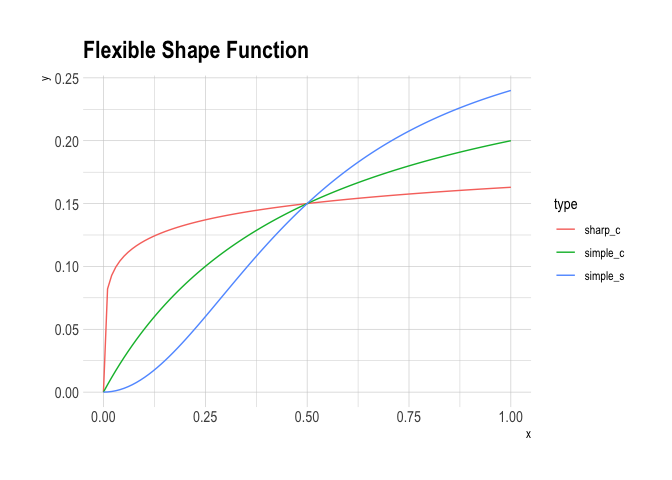
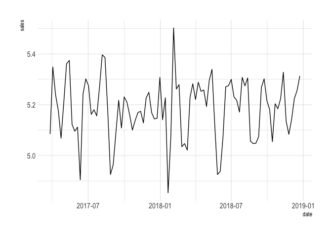
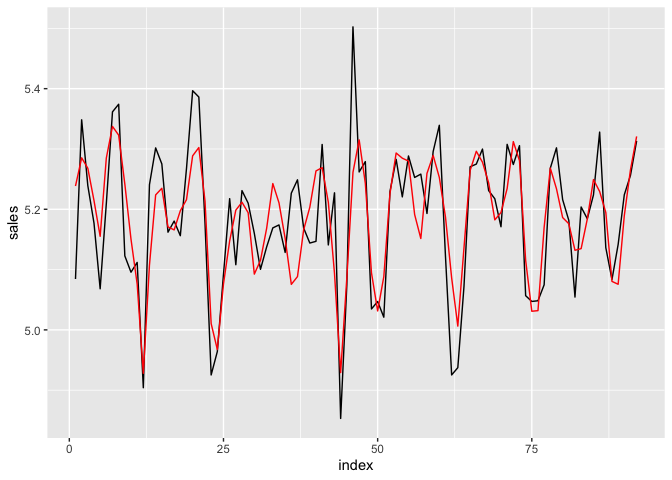
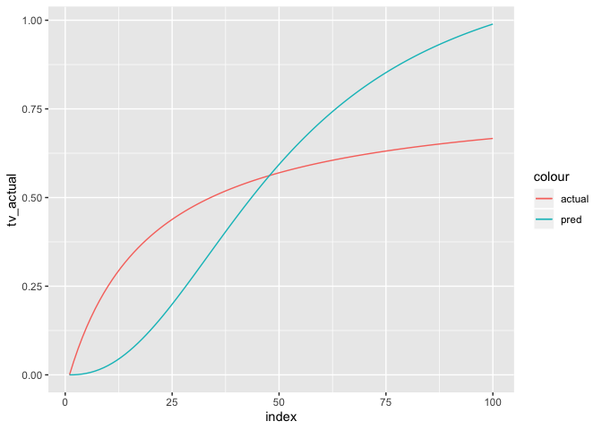
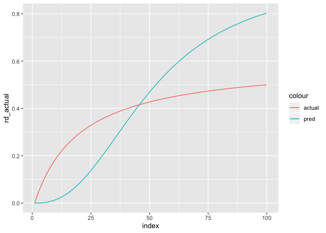
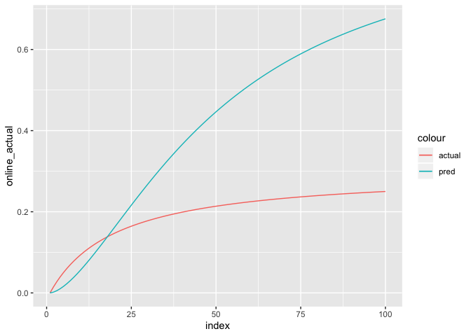

<!-- README.md is generated from README.Rmd. Please edit that file -->

``` r
library(tidyverse)
#> ── Attaching packages ────────────────────────────────────────────────────────────── tidyverse 1.3.0 ──
#> ✔ ggplot2 3.2.1     ✔ purrr   0.3.3
#> ✔ tibble  2.1.3     ✔ dplyr   0.8.3
#> ✔ tidyr   1.0.0     ✔ stringr 1.4.0
#> ✔ readr   1.3.1     ✔ forcats 0.4.0
#> ── Conflicts ───────────────────────────────────────────────────────────────── tidyverse_conflicts() ──
#> ✖ dplyr::filter() masks stats::filter()
#> ✖ dplyr::lag()    masks stats::lag()
library(corrr)
library(hrbrthemes)
#> NOTE: Either Arial Narrow or Roboto Condensed fonts are required to use these themes.
#>       Please use hrbrthemes::import_roboto_condensed() to install Roboto Condensed and
#>       if Arial Narrow is not on your system, please see http://bit.ly/arialnarrow
# -------------------------------------
# Generate Media Data
# Equation: y=a*sin(b*t)+c.unif*amp
# -------------------------------------
set.seed(1)
n <- 52 * 2 # number of data points
t <- seq(0, 4*pi, length.out = n)
b <- 8 # essentially the number of pillars in a year
c.norm1 <- rnorm(n,0,0.5)
c.norm2 <- rnorm(n,0, 0.75)
c.norm3 <- rnorm(n,0, 0.75)
amp <- 2
# generate data and calculate "y"
media_tv <- 1*sin(b*t)+c.norm1*amp # Gaussian/normal error
media_radio <- 1*sin(b*t)+c.norm2*amp # Gaussian/normal error
media_online <- 1*sin(b*t)+c.norm3*amp # Gaussian/normal error
week <- seq(1:104)

sim_df <- as.data.frame(list(week = week,
                            media_tv = media_tv,
                            media_radio = media_radio,
                            media_online = media_online)) %>% 
  mutate_at(vars(media_tv, media_radio,media_online), percent_rank)

sim_df %>% 
  ggplot(aes(x = week)) +
  geom_line(aes(y = media_tv, color = "tv")) +
  geom_line(aes(y = media_radio, color = "radio")) +
  geom_line(aes(y = media_online, color = "online")) +
  theme_ipsum()
```

<!-- -->

``` r
# -----------------------------------------------------------------------------
# Generate Menu Price Data
# Equation: y=ARIMA(1,1,0) with AR = 0.50
# Interpretation: Price has increased by 3 dollars in the last year
# -----------------------------------------------------------------------------
price <- arima.sim(n = n, list(ar = c(0.8897, -0.4858), ma = c(0.279, 0.2488)), sd = sqrt(0.001))
mean(price); sd(price)
#> [1] -0.001195423
#> [1] 0.05821377
hist(price)
```

<!-- -->

``` r
plot(price)
```

<!-- -->

``` r

#price <- as.numeric(scale(price))
sim_df <- add_column(sim_df, price) 

sim_df %>% 
  gather(key = vartype, value = value, -week) %>% 
  ggplot(aes(x = week, y = value)) +
  geom_col()+
  facet_wrap(~vartype) +
  hrbrthemes::theme_ipsum()
#> Warning: attributes are not identical across measure variables;
#> they will be dropped
```

<!-- -->

``` r
# --------------------------------------------------
# Scale media to [0, 1] as per paper
# media_i = x_i - min(x) / max(x) - min(x)
# --------------------------------------------------
my_normalizer <- function(x) (x - min(x)) / (max(x) - min(x))

sim_df <- sim_df %>% 
  mutate_at(vars(-week,-price), my_normalizer)

sim_df %>% write_csv("sim_df.csv")

sim_df %>% 
  gather(key = vartype, value = value, -week) %>% 
  ggplot(aes(x = week, y = value)) +
  geom_col()+
  facet_wrap(~vartype) +
  hrbrthemes::theme_ipsum()
#> Warning: attributes are not identical across measure variables;
#> they will be dropped
```

<!-- -->

``` r
#----------------------------------------------------------------------------- 
# Generate adstock as described in the Google Paper:
# Bayesian Methods for Media Mix Modeling with Carryover and Shape Effects
#----------------------------------------------------------------------------- 
library(tidyquant)
#> Loading required package: lubridate
#> 
#> Attaching package: 'lubridate'
#> The following object is masked from 'package:base':
#> 
#>     date
#> Loading required package: PerformanceAnalytics
#> Loading required package: xts
#> Loading required package: zoo
#> 
#> Attaching package: 'zoo'
#> The following objects are masked from 'package:base':
#> 
#>     as.Date, as.Date.numeric
#> Registered S3 method overwritten by 'xts':
#>   method     from
#>   as.zoo.xts zoo
#> 
#> Attaching package: 'xts'
#> The following objects are masked from 'package:dplyr':
#> 
#>     first, last
#> 
#> Attaching package: 'PerformanceAnalytics'
#> The following object is masked from 'package:graphics':
#> 
#>     legend
#> Loading required package: quantmod
#> Loading required package: TTR
#> Registered S3 method overwritten by 'quantmod':
#>   method            from
#>   as.zoo.data.frame zoo
#> Version 0.4-0 included new data defaults. See ?getSymbols.
#> ══ Need to Learn tidyquant? ═══════════════════════════════════════════════════════════════════════════
#> Business Science offers a 1-hour course - Learning Lab #9: Performance Analysis & Portfolio Optimization with tidyquant!
#> </> Learn more at: https://university.business-science.io/p/learning-labs-pro </>

# fake data
date <- seq(from = as.Date("2018-01-01"), length.out = 104, by = "1 week")
x    <- c(rep(100,5), rep(0,99)) %>% 
  as_tibble() %>% 
  add_column(date) %>%
  rename(x = value)
#> Warning: Calling `as_tibble()` on a vector is discouraged, because the behavior is likely to change in the future. Use `tibble::enframe(name = NULL)` instead.
#> This warning is displayed once per session.

# -----------------------------------------------------------------------------
# Name:            Carryover Effect
#
# Description:    Two functions are provided for modeling the decay of ad 
#                 effect. 
#
# Geometric:      This function assumes that week 1 is the most impactfull
#                 week of the the promo. Subsequent weeks have a slow decline
#                 as defined by the rate. A larger rate give a slower decline
#
# Delayed:        This function assumes that a week after week 1 is the most
#                 impactfull week. It has a weight that is proportional to 
#                 The normal distribution around the week of impact defined
#                 by theta
# -----------------------------------------------------------------------------
geom_decay    <- function(rate,l,...) sum((rate^l) *...) / sum(rate^l)
delayed_decay <- function(rate,l,theta,...){
  sum((rate^(l-theta)^2) *...) / sum(rate^(l-theta)^2) 
}

# Examples of calculating adstock from both functions
# Since the values are calculated on a rolling window
# it is neccesary to used something like tq_mutate
# to get values for a given time-series

L = 13
x %>% 
  tq_mutate(select = x, mutate_fun = rollapply, width = L, align = "right",
    FUN = geom_decay,
    #function args
    rate = 0.8,
    l = seq(from = 0 , to = L-1),
    #ts_mutate
    col_rename = "adstock_geometric_decay"
  )
#> # A tibble: 104 x 3
#>        x date       adstock_geometric_decay
#>    <dbl> <date>                       <dbl>
#>  1   100 2018-01-01                      NA
#>  2   100 2018-01-08                      NA
#>  3   100 2018-01-15                      NA
#>  4   100 2018-01-22                      NA
#>  5   100 2018-01-29                      NA
#>  6     0 2018-02-05                      NA
#>  7     0 2018-02-12                      NA
#>  8     0 2018-02-19                      NA
#>  9     0 2018-02-26                      NA
#> 10     0 2018-03-05                      NA
#> # … with 94 more rows
x %>% 
  tq_mutate(select = x, mutate_fun = rollapply, width = L, align = "right",
    FUN = delayed_decay,
    #function args
    rate = 0.8, # rate of 0.4 to 0.8 is sensible  
    theta = 1,   # theta should be about 1 to 3 
    l = seq(from = 0 , to = L-1),
    #ts_mutate
    col_rename = "adstock_delayed_decay"
  )
#> # A tibble: 104 x 3
#>        x date       adstock_delayed_decay
#>    <dbl> <date>                     <dbl>
#>  1   100 2018-01-01                    NA
#>  2   100 2018-01-08                    NA
#>  3   100 2018-01-15                    NA
#>  4   100 2018-01-22                    NA
#>  5   100 2018-01-29                    NA
#>  6     0 2018-02-05                    NA
#>  7     0 2018-02-12                    NA
#>  8     0 2018-02-19                    NA
#>  9     0 2018-02-26                    NA
#> 10     0 2018-03-05                    NA
#> # … with 94 more rows
```

``` r
# -----------------------------------------------------------------------------
# Name:            Shape Effect
#
# Description:    It is not enough to model the decay and the lag of an ad.
#                 The shape of its saturation is also an important funtion
#                 that deserves attention.
#
# Hill Function:  Marketing Mix Modelers often chose between S-curves and
#                 C-curves when modeling media impact on sales. 
#                 Pharmacology uses the Hill function to model receptors.
#                 It provides a flexible functional form that may take the 
#                 form of both an S-curve and a C-curve which provides a
#                 convinient solution to parameterizing the function 
#                 representing shape effect.
# K:              Half Saturation
# S:              Slope
# B:              Beta
#
# Problem:        It may be the case that the Slope parameter "S" may have to 
#                 be set to 1 (S = 1). This is an issue with identifiability
# -----------------------------------------------------------------------------

# Define Function
BHill <- function(B,K,S,...) B - ((K^S * B)/(...^S + K^S))

# set up example data
x <- seq(0,1, length.out = 100) # media must be transformed to [0, 1] scale
                                # for ease of use

params <- tribble(
  ~K,   ~S,   ~B,  ~type,
  0.5,  1,    0.3, "simple_c",
  0.5,  2,    0.3, "simple_s",
  0.5,  0.25,  0.3, "sharp_c"
)

bhill_df <- crossing(x,params) %>% 
  mutate(y = BHill(B,K,S,x))

bhill_df %>% 
  ggplot(aes(x = x, y = y, color = type)) +
  geom_line() +
  labs(title = "Flexible Shape Function") +
  hrbrthemes::theme_ipsum()
```

<!-- -->

``` r
# ============================================================================= 
# Simulation
# Description:  With simulated media data as "media variables" and 
#               simulated price as a "control variable" I applied the neccesary
#               transfomations (adstock & shape) to the input variables with
#               various parameters to test the ability of this model to 
#               discover the parameters I set
#
# Equation:     Weekly sales have the following form:
#
#               sales_wk = tau + BHill_tv_wk + BHill_online_wk + BHill_radio_wk 
#                          + gamma*price_wk + e_wk
# ============================================================================= 

#------------------------------------------------------------ 
#
# Media Parameters
# ----------------
# Parameter | Media_tv  | Media_radio  | Media_online
#  rate         0.6         0.8            0.8
#  theta        5           3              4
#  K            0.2         0.2            0.2
#  S            1           2              2
#  B            0.8         0.6            0.3
#
# Other variables
# ----------------
# Parameter | Value   
#  L          13 
#  tau        4      
#  gamma      0.05   
#  e          normal(0,0.05^2)     
#------------------------------------------------------------ 
fat_data <- sim_df %>% 
  add_column(date = seq(as.Date("2017-01-01"), length.out = n, by = "week")) %>%  
  # adstocks
  tq_mutate(select = media_tv, mutate_fun = rollapply, width = L, align = "right",
    FUN = delayed_decay,rate = 0.6, theta = 1,   
    l = seq(from = 0 , to = L-1),col_rename = "adstk_tv"
  )%>% 
  tq_mutate(select = media_radio, mutate_fun = rollapply, width = L, align = "right",
    FUN = delayed_decay,rate = 0.8, theta = 1,   
    l = seq(from = 0 , to = L-1),col_rename = "adstk_radio"
  )%>% 
  tq_mutate(select = media_online, mutate_fun = rollapply, width = L, align = "right",
    FUN = delayed_decay,rate = 0.8, theta = 1,   
    l = seq(from = 0 , to = L-1),col_rename = "adstk_online"
  )%>% 
  # Shape
  mutate(m_tv = BHill(K = 0.2, S = 1, B = 0.8,adstk_tv)) %>% 
  mutate(m_rd = BHill(K = 0.2, S = 1, B = 0.6,adstk_radio)) %>% 
  mutate(m_online = BHill(K = 0.2, S = 1, B = 0.3,adstk_online)) %>% 
  #and errors
  mutate(e = rnorm(n = n(), mean = 0, sd = 0.25^2)) %>% 
  mutate(sales = 4 + m_tv + m_rd + m_online + .5 * price + e)

clean_data <- fat_data %>% 
  select(date, sales,m_tv,m_rd,m_online,price,e) %>% 
  na.omit()
clean_data
#> # A tibble: 92 x 7
#>    date       sales  m_tv  m_rd m_online    price        e
#>    <date>     <dbl> <dbl> <dbl>    <dbl>    <dbl>    <dbl>
#>  1 2017-03-26  5.08 0.597 0.471    0.227 -0.129   -0.146  
#>  2 2017-04-02  5.35 0.619 0.483    0.226 -0.0789   0.0601 
#>  3 2017-04-09  5.24 0.606 0.469    0.210 -0.0167  -0.0378 
#>  4 2017-04-16  5.18 0.547 0.452    0.198  0.0544  -0.0471 
#>  5 2017-04-23  5.07 0.470 0.435    0.200  0.122   -0.0972 
#>  6 2017-04-30  5.21 0.568 0.434    0.223  0.151   -0.0909 
#>  7 2017-05-07  5.36 0.633 0.430    0.233  0.125    0.00352
#>  8 2017-05-14  5.37 0.640 0.446    0.223  0.0671   0.0318 
#>  9 2017-05-21  5.12 0.625 0.427    0.201  0.00162 -0.131  
#> 10 2017-05-28  5.10 0.596 0.364    0.188  0.0200  -0.0628 
#> # … with 82 more rows
```

``` r
library(hrbrthemes)
# some plots of the data. see if it matches the paper okay
clean_data %>% 
  ggplot(aes(date, sales)) + geom_line() + theme_ipsum()
```

<!-- -->

``` r
clean_data %>% 
  select(price, m_tv, m_rd, m_online) %>% 
  correlate()
#> 
#> Correlation method: 'pearson'
#> Missing treated using: 'pairwise.complete.obs'
#> # A tibble: 4 x 5
#>   rowname    price   m_tv    m_rd m_online
#>   <chr>      <dbl>  <dbl>   <dbl>    <dbl>
#> 1 price    NA      -0.114 -0.0467   -0.202
#> 2 m_tv     -0.114  NA      0.349     0.441
#> 3 m_rd     -0.0467  0.349 NA         0.300
#> 4 m_online -0.202   0.441  0.300    NA
```

``` r
clean_data %>% 
  select(sales, m_tv, m_rd, m_online, e, price) %>% 
  summarise_all(var) %>% 
  transmute(var_tv = m_tv / sales, 
         var_rd =   m_rd / sales, 
         var_online = m_online / sales,
         var_noise = e / sales,
         price = price / sales)
#> # A tibble: 1 x 5
#>   var_tv var_rd var_online var_noise price
#>    <dbl>  <dbl>      <dbl>     <dbl> <dbl>
#> 1  0.302  0.106     0.0263     0.357 0.259
```

``` r
clean_data %>% write_csv("clean_data.csv")
```

``` r
media_data <- clean_data %>% select(contains("m_"))
# data Prep
N <- nrow(clean_data)
Y <- clean_data$sales
max_lag <- 13
num_media <- 3
lag_vec <- seq(0, max_lag - 1)
X_media <- array(data = media_data, dim = c(num_media))
num_ctrl <- 1
X_ctrl <- clean_data$price

stan_data <- list(N=N, Y=Y, max_lag=max_lag, num_media=num_media,
                  lag_vec=lag_vec,X_media=X_media,
                  num_ctrl=num_ctrl,X_ctrl=X_ctrl)

stan_data %>% str
#> List of 8
#>  $ N        : int 92
#>  $ Y        : num [1:92] 5.08 5.35 5.24 5.18 5.07 ...
#>  $ max_lag  : num 13
#>  $ num_media: num 3
#>  $ lag_vec  : int [1:13] 0 1 2 3 4 5 6 7 8 9 ...
#>  $ X_media  :Classes 'tbl_df', 'tbl' and 'data.frame':   92 obs. of  3 variables:
#>   ..$ : num [1:92] 0.597 0.619 0.606 0.547 0.47 ...
#>   ..$ : num [1:92] 0.471 0.483 0.469 0.452 0.435 ...
#>   ..$ : num [1:92] 0.227 0.226 0.21 0.198 0.2 ...
#>   ..- attr(*, "na.action")= 'omit' Named int [1:12] 1 2 3 4 5 6 7 8 9 10 ...
#>   .. ..- attr(*, "names")= chr [1:12] "1" "2" "3" "4" ...
#>   ..- attr(*, "dim")= int 3
#>  $ num_ctrl : num 1
#>  $ X_ctrl   : num [1:92] -0.1289 -0.0789 -0.0167 0.0544 0.1218 ...
```

``` r
library(rstan)
#> Loading required package: StanHeaders
#> rstan (Version 2.19.2, GitRev: 2e1f913d3ca3)
#> For execution on a local, multicore CPU with excess RAM we recommend calling
#> options(mc.cores = parallel::detectCores()).
#> To avoid recompilation of unchanged Stan programs, we recommend calling
#> rstan_options(auto_write = TRUE)
#> 
#> Attaching package: 'rstan'
#> The following object is masked from 'package:tidyr':
#> 
#>     extract
clean_data <- read_csv("clean_data.csv")
#> Parsed with column specification:
#> cols(
#>   date = col_date(format = ""),
#>   sales = col_double(),
#>   m_tv = col_double(),
#>   m_rd = col_double(),
#>   m_online = col_double(),
#>   price = col_double(),
#>   e = col_double()
#> )
media_data <- clean_data %>% select(contains("m_"))
long_media_array <- c(clean_data$m_tv,clean_data$m_rd,clean_data$m_online)
# data Prep
N <- nrow(clean_data)
Y <- clean_data$sales
max_lag <- 13
num_media <- 3
lag_vec <- seq(0, max_lag - 1)
X_media <- array(data = media_data, dim = c(3,13))
X_media <- array(data = long_media_array, dim = c(92,3,13))
num_ctrl <- 1
X_ctrl <- clean_data %>% select(price) %>% as.vector()

stan_data <- list(N=N, Y=Y, max_lag=max_lag, num_media=num_media,
                  lag_vec=lag_vec,X_media=X_media,
                  num_ctrl=num_ctrl,X_ctrl=X_ctrl)

m.stan <- stan(file = "model.stan",data = stan_data, iter = 3000, chains = 1, control = list(max_treedepth = 15))
#> Warning in readLines(file, warn = TRUE): incomplete final line found on '/Users/
#> alexhallam/r/media_mix_sim/model.stan'
#> 
#> SAMPLING FOR MODEL 'model' NOW (CHAIN 1).
#> Chain 1: 
#> Chain 1: Gradient evaluation took 0.001078 seconds
#> Chain 1: 1000 transitions using 10 leapfrog steps per transition would take 10.78 seconds.
#> Chain 1: Adjust your expectations accordingly!
#> Chain 1: 
#> Chain 1: 
#> Chain 1: Iteration:    1 / 3000 [  0%]  (Warmup)
#> Chain 1: Iteration:  300 / 3000 [ 10%]  (Warmup)
#> Chain 1: Iteration:  600 / 3000 [ 20%]  (Warmup)
#> Chain 1: Iteration:  900 / 3000 [ 30%]  (Warmup)
#> Chain 1: Iteration: 1200 / 3000 [ 40%]  (Warmup)
#> Chain 1: Iteration: 1500 / 3000 [ 50%]  (Warmup)
#> Chain 1: Iteration: 1501 / 3000 [ 50%]  (Sampling)
#> Chain 1: Iteration: 1800 / 3000 [ 60%]  (Sampling)
#> Chain 1: Iteration: 2100 / 3000 [ 70%]  (Sampling)
#> Chain 1: Iteration: 2400 / 3000 [ 80%]  (Sampling)
#> Chain 1: Iteration: 2700 / 3000 [ 90%]  (Sampling)
#> Chain 1: Iteration: 3000 / 3000 [100%]  (Sampling)
#> Chain 1: 
#> Chain 1:  Elapsed Time: 321.411 seconds (Warm-up)
#> Chain 1:                238.065 seconds (Sampling)
#> Chain 1:                559.476 seconds (Total)
#> Chain 1:
#> Warning: There were 18 divergent transitions after warmup. Increasing adapt_delta above 0.8 may help. See
#> http://mc-stan.org/misc/warnings.html#divergent-transitions-after-warmup
#> Warning: Examine the pairs() plot to diagnose sampling problems

#summary(m.stan)
```

``` r
m.stan
#> Inference for Stan model: model.
#> 1 chains, each with iter=3000; warmup=1500; thin=1; 
#> post-warmup draws per chain=1500, total post-warmup draws=1500.
#> 
#>                          mean se_mean   sd   2.5%    25%    50%    75%  97.5%
#> noise_var                0.01    0.00 0.00   0.00   0.00   0.01   0.01   0.01
#> tau                      4.02    0.03 0.47   2.87   3.78   4.11   4.36   4.71
#> beta_medias[1]           1.06    0.02 0.44   0.43   0.75   0.99   1.29   2.09
#> beta_medias[2]           0.95    0.02 0.41   0.32   0.65   0.91   1.18   1.88
#> beta_medias[3]           0.98    0.02 0.51   0.22   0.58   0.89   1.30   2.13
#> gamma_ctrl[1]            0.39    0.00 0.13   0.13   0.30   0.39   0.49   0.67
#> retain_rate[1]           0.51    0.00 0.19   0.16   0.36   0.51   0.65   0.85
#> retain_rate[2]           0.49    0.00 0.18   0.15   0.36   0.49   0.62   0.84
#> retain_rate[3]           0.49    0.00 0.18   0.16   0.36   0.49   0.62   0.84
#> delay[1]                 6.10    0.08 3.40   0.41   3.22   6.15   9.01  11.71
#> delay[2]                 6.17    0.09 3.53   0.30   2.97   6.26   9.19  11.74
#> delay[3]                 6.03    0.09 3.54   0.34   2.91   6.09   9.16  11.72
#> ec[1]                    0.59    0.01 0.18   0.26   0.46   0.59   0.74   0.91
#> ec[2]                    0.54    0.01 0.19   0.19   0.40   0.54   0.67   0.89
#> ec[3]                    0.40    0.01 0.21   0.09   0.23   0.39   0.55   0.83
#> slope[1]                 2.68    0.05 1.26   0.99   1.76   2.45   3.33   5.82
#> slope[2]                 2.63    0.04 1.27   0.89   1.68   2.38   3.29   5.84
#> slope[3]                 2.22    0.04 1.25   0.66   1.34   1.99   2.77   5.50
#> mu[1]                    5.24    0.00 0.02   5.20   5.22   5.24   5.25   5.28
#> mu[2]                    5.29    0.00 0.02   5.25   5.27   5.29   5.30   5.32
#> mu[3]                    5.27    0.00 0.01   5.24   5.26   5.27   5.28   5.30
#> mu[4]                    5.21    0.00 0.02   5.18   5.20   5.21   5.23   5.24
#> mu[5]                    5.16    0.00 0.02   5.11   5.14   5.15   5.17   5.20
#> mu[6]                    5.28    0.00 0.02   5.24   5.27   5.28   5.30   5.33
#> mu[7]                    5.34    0.00 0.02   5.29   5.32   5.34   5.35   5.39
#> mu[8]                    5.32    0.00 0.02   5.29   5.31   5.32   5.33   5.36
#> mu[9]                    5.24    0.00 0.01   5.21   5.23   5.24   5.25   5.27
#> mu[10]                   5.15    0.00 0.02   5.12   5.14   5.15   5.16   5.19
#> mu[11]                   5.08    0.00 0.02   5.04   5.06   5.08   5.09   5.11
#> mu[12]                   4.93    0.00 0.04   4.85   4.90   4.93   4.95   5.00
#> mu[13]                   5.11    0.00 0.02   5.08   5.10   5.11   5.12   5.14
#> mu[14]                   5.22    0.00 0.02   5.19   5.21   5.22   5.24   5.26
#> mu[15]                   5.23    0.00 0.02   5.20   5.22   5.24   5.25   5.27
#> mu[16]                   5.17    0.00 0.02   5.13   5.16   5.17   5.18   5.21
#> mu[17]                   5.17    0.00 0.01   5.14   5.16   5.17   5.17   5.19
#> mu[18]                   5.20    0.00 0.01   5.18   5.19   5.20   5.20   5.22
#> mu[19]                   5.22    0.00 0.02   5.19   5.21   5.22   5.23   5.25
#> mu[20]                   5.29    0.00 0.02   5.26   5.28   5.29   5.30   5.32
#> mu[21]                   5.30    0.00 0.02   5.27   5.29   5.30   5.31   5.33
#> mu[22]                   5.21    0.00 0.02   5.18   5.20   5.21   5.23   5.25
#> mu[23]                   5.01    0.00 0.03   4.94   4.99   5.01   5.03   5.07
#> mu[24]                   4.97    0.00 0.02   4.92   4.95   4.97   4.98   5.01
#> mu[25]                   5.08    0.00 0.01   5.05   5.07   5.08   5.09   5.10
#> mu[26]                   5.15    0.00 0.02   5.11   5.14   5.15   5.16   5.18
#> mu[27]                   5.20    0.00 0.01   5.17   5.19   5.20   5.21   5.23
#> mu[28]                   5.21    0.00 0.01   5.19   5.21   5.21   5.22   5.23
#> mu[29]                   5.19    0.00 0.01   5.17   5.19   5.19   5.20   5.22
#> mu[30]                   5.09    0.00 0.02   5.04   5.08   5.09   5.11   5.14
#> mu[31]                   5.12    0.00 0.02   5.08   5.10   5.11   5.13   5.15
#> mu[32]                   5.17    0.00 0.02   5.14   5.16   5.17   5.18   5.20
#> mu[33]                   5.24    0.00 0.01   5.21   5.23   5.24   5.25   5.27
#> mu[34]                   5.21    0.00 0.01   5.19   5.20   5.21   5.22   5.24
#> mu[35]                   5.15    0.00 0.01   5.12   5.14   5.15   5.16   5.18
#> mu[36]                   5.08    0.00 0.02   5.04   5.06   5.08   5.09   5.11
#> mu[37]                   5.09    0.00 0.02   5.05   5.08   5.09   5.10   5.13
#> mu[38]                   5.17    0.00 0.02   5.13   5.15   5.17   5.18   5.20
#> mu[39]                   5.20    0.00 0.02   5.17   5.19   5.20   5.22   5.24
#> mu[40]                   5.26    0.00 0.01   5.23   5.25   5.26   5.27   5.29
#> mu[41]                   5.27    0.00 0.01   5.24   5.26   5.27   5.28   5.29
#> mu[42]                   5.21    0.00 0.01   5.19   5.20   5.21   5.22   5.23
#> mu[43]                   5.09    0.00 0.01   5.06   5.08   5.09   5.10   5.12
#> mu[44]                   4.93    0.00 0.03   4.87   4.91   4.93   4.95   4.99
#> mu[45]                   5.09    0.00 0.02   5.05   5.07   5.09   5.10   5.12
#> mu[46]                   5.26    0.00 0.01   5.24   5.25   5.26   5.27   5.29
#> mu[47]                   5.32    0.00 0.02   5.28   5.30   5.31   5.33   5.35
#> mu[48]                   5.24    0.00 0.02   5.20   5.23   5.24   5.26   5.29
#> mu[49]                   5.09    0.00 0.03   5.04   5.07   5.09   5.11   5.15
#> mu[50]                   5.03    0.00 0.03   4.97   5.01   5.03   5.05   5.09
#> mu[51]                   5.09    0.00 0.02   5.06   5.08   5.09   5.10   5.12
#> mu[52]                   5.23    0.00 0.01   5.21   5.22   5.23   5.23   5.25
#> mu[53]                   5.29    0.00 0.01   5.27   5.28   5.29   5.30   5.32
#> mu[54]                   5.28    0.00 0.01   5.26   5.28   5.28   5.29   5.31
#> mu[55]                   5.28    0.00 0.01   5.25   5.27   5.28   5.29   5.31
#> mu[56]                   5.19    0.00 0.02   5.16   5.18   5.19   5.20   5.23
#> mu[57]                   5.15    0.00 0.02   5.11   5.14   5.15   5.17   5.20
#> mu[58]                   5.26    0.00 0.02   5.22   5.25   5.26   5.27   5.30
#> mu[59]                   5.29    0.00 0.02   5.25   5.28   5.29   5.30   5.33
#> mu[60]                   5.25    0.00 0.02   5.21   5.24   5.25   5.27   5.29
#> mu[61]                   5.19    0.00 0.02   5.15   5.17   5.19   5.20   5.23
#> mu[62]                   5.09    0.00 0.02   5.05   5.07   5.09   5.10   5.13
#> mu[63]                   5.01    0.00 0.02   4.97   4.99   5.01   5.02   5.04
#> mu[64]                   5.14    0.00 0.02   5.10   5.12   5.14   5.15   5.17
#> mu[65]                   5.26    0.00 0.02   5.23   5.25   5.26   5.28   5.30
#> mu[66]                   5.30    0.00 0.02   5.26   5.28   5.30   5.31   5.33
#> mu[67]                   5.28    0.00 0.01   5.26   5.27   5.28   5.29   5.30
#> mu[68]                   5.24    0.00 0.01   5.22   5.23   5.24   5.25   5.27
#> mu[69]                   5.18    0.00 0.02   5.15   5.17   5.18   5.19   5.21
#> mu[70]                   5.19    0.00 0.01   5.18   5.19   5.19   5.20   5.21
#> mu[71]                   5.23    0.00 0.01   5.21   5.23   5.23   5.24   5.26
#> mu[72]                   5.31    0.00 0.02   5.28   5.30   5.31   5.32   5.35
#> mu[73]                   5.28    0.00 0.02   5.24   5.27   5.28   5.29   5.32
#> mu[74]                   5.12    0.00 0.02   5.07   5.10   5.12   5.13   5.16
#> mu[75]                   5.03    0.00 0.03   4.97   5.01   5.03   5.05   5.09
#> mu[76]                   5.03    0.00 0.04   4.96   5.01   5.03   5.06   5.10
#> mu[77]                   5.17    0.00 0.02   5.14   5.16   5.17   5.18   5.20
#> mu[78]                   5.27    0.00 0.01   5.25   5.26   5.27   5.28   5.29
#> mu[79]                   5.23    0.00 0.01   5.21   5.22   5.23   5.24   5.26
#> mu[80]                   5.19    0.00 0.02   5.16   5.18   5.19   5.20   5.22
#> mu[81]                   5.18    0.00 0.01   5.15   5.17   5.18   5.19   5.20
#> mu[82]                   5.13    0.00 0.01   5.11   5.12   5.13   5.14   5.15
#> mu[83]                   5.13    0.00 0.01   5.11   5.13   5.14   5.14   5.16
#> mu[84]                   5.18    0.00 0.01   5.16   5.17   5.18   5.19   5.21
#> mu[85]                   5.25    0.00 0.02   5.22   5.24   5.25   5.26   5.28
#> mu[86]                   5.23    0.00 0.02   5.19   5.22   5.23   5.24   5.27
#> mu[87]                   5.19    0.00 0.01   5.17   5.19   5.20   5.20   5.22
#> mu[88]                   5.08    0.00 0.02   5.05   5.07   5.08   5.09   5.12
#> mu[89]                   5.08    0.00 0.02   5.04   5.06   5.08   5.09   5.11
#> mu[90]                   5.19    0.00 0.01   5.17   5.18   5.19   5.20   5.21
#> mu[91]                   5.27    0.00 0.02   5.23   5.25   5.27   5.28   5.30
#> mu[92]                   5.32    0.00 0.02   5.28   5.31   5.32   5.33   5.36
#> cum_effect               0.23    0.00 0.00   0.23   0.23   0.23   0.23   0.23
#> cum_effects_hill[1,1]    0.52    0.01 0.19   0.19   0.38   0.50   0.65   0.90
#> cum_effects_hill[1,2]    0.46    0.01 0.21   0.12   0.30   0.43   0.60   0.93
#> cum_effects_hill[1,3]    0.36    0.01 0.25   0.04   0.16   0.30   0.49   0.92
#> cum_effects_hill[2,1]    0.54    0.01 0.18   0.22   0.40   0.52   0.67   0.91
#> cum_effects_hill[2,2]    0.47    0.01 0.21   0.13   0.31   0.44   0.61   0.93
#> cum_effects_hill[2,3]    0.35    0.01 0.25   0.04   0.16   0.29   0.49   0.92
#> cum_effects_hill[3,1]    0.53    0.01 0.19   0.20   0.39   0.51   0.65   0.90
#> cum_effects_hill[3,2]    0.46    0.01 0.21   0.12   0.30   0.43   0.59   0.93
#> cum_effects_hill[3,3]    0.33    0.01 0.24   0.03   0.14   0.27   0.46   0.90
#> cum_effects_hill[4,1]    0.47    0.01 0.19   0.14   0.33   0.46   0.60   0.87
#> cum_effects_hill[4,2]    0.44    0.01 0.21   0.11   0.28   0.41   0.57   0.92
#> cum_effects_hill[4,3]    0.31    0.01 0.23   0.03   0.12   0.25   0.44   0.88
#> cum_effects_hill[5,1]    0.39    0.01 0.19   0.07   0.24   0.37   0.51   0.81
#> cum_effects_hill[5,2]    0.42    0.01 0.21   0.09   0.25   0.39   0.55   0.91
#> cum_effects_hill[5,3]    0.31    0.01 0.24   0.03   0.12   0.25   0.44   0.88
#> cum_effects_hill[6,1]    0.49    0.01 0.19   0.16   0.35   0.48   0.62   0.88
#> cum_effects_hill[6,2]    0.42    0.01 0.21   0.09   0.25   0.39   0.55   0.91
#> cum_effects_hill[6,3]    0.35    0.01 0.24   0.04   0.16   0.29   0.48   0.91
#> cum_effects_hill[7,1]    0.55    0.01 0.18   0.23   0.42   0.53   0.68   0.91
#> cum_effects_hill[7,2]    0.41    0.01 0.21   0.09   0.25   0.39   0.55   0.90
#> cum_effects_hill[7,3]    0.36    0.01 0.25   0.05   0.17   0.30   0.50   0.92
#> cum_effects_hill[8,1]    0.56    0.01 0.18   0.24   0.42   0.54   0.69   0.92
#> cum_effects_hill[8,2]    0.43    0.01 0.21   0.10   0.27   0.40   0.57   0.91
#> cum_effects_hill[8,3]    0.35    0.01 0.24   0.04   0.16   0.29   0.48   0.91
#> cum_effects_hill[9,1]    0.54    0.01 0.18   0.22   0.41   0.52   0.67   0.91
#> cum_effects_hill[9,2]    0.41    0.01 0.21   0.09   0.25   0.38   0.54   0.90
#> cum_effects_hill[9,3]    0.32    0.01 0.24   0.03   0.13   0.26   0.44   0.88
#> cum_effects_hill[10,1]   0.52    0.01 0.19   0.19   0.38   0.50   0.65   0.89
#> cum_effects_hill[10,2]   0.34    0.01 0.21   0.05   0.17   0.31   0.45   0.85
#> cum_effects_hill[10,3]   0.29    0.01 0.23   0.02   0.11   0.23   0.43   0.86
#> cum_effects_hill[11,1]   0.44    0.01 0.19   0.11   0.29   0.42   0.56   0.85
#> cum_effects_hill[11,2]   0.33    0.01 0.21   0.04   0.16   0.29   0.44   0.84
#> cum_effects_hill[11,3]   0.29    0.01 0.23   0.02   0.11   0.23   0.42   0.86
#> cum_effects_hill[12,1]   0.28    0.01 0.18   0.03   0.13   0.25   0.39   0.69
#> cum_effects_hill[12,2]   0.36    0.01 0.21   0.06   0.20   0.34   0.49   0.87
#> cum_effects_hill[12,3]   0.27    0.01 0.22   0.02   0.09   0.21   0.39   0.82
#> cum_effects_hill[13,1]   0.42    0.01 0.19   0.09   0.27   0.40   0.54   0.83
#> cum_effects_hill[13,2]   0.41    0.01 0.21   0.09   0.25   0.39   0.55   0.91
#> cum_effects_hill[13,3]   0.30    0.01 0.23   0.02   0.11   0.24   0.43   0.86
#> cum_effects_hill[14,1]   0.53    0.01 0.19   0.20   0.39   0.51   0.66   0.90
#> cum_effects_hill[14,2]   0.44    0.01 0.21   0.11   0.28   0.41   0.58   0.92
#> cum_effects_hill[14,3]   0.32    0.01 0.24   0.03   0.13   0.26   0.45   0.89
#> cum_effects_hill[15,1]   0.55    0.01 0.18   0.23   0.41   0.53   0.68   0.91
#> cum_effects_hill[15,2]   0.44    0.01 0.21   0.11   0.28   0.41   0.58   0.92
#> cum_effects_hill[15,3]   0.32    0.01 0.24   0.03   0.13   0.26   0.45   0.89
#> cum_effects_hill[16,1]   0.52    0.01 0.19   0.18   0.38   0.50   0.64   0.89
#> cum_effects_hill[16,2]   0.42    0.01 0.21   0.09   0.25   0.39   0.55   0.91
#> cum_effects_hill[16,3]   0.32    0.01 0.24   0.03   0.13   0.26   0.45   0.89
#> cum_effects_hill[17,1]   0.50    0.01 0.19   0.16   0.36   0.48   0.62   0.88
#> cum_effects_hill[17,2]   0.40    0.01 0.21   0.08   0.24   0.37   0.53   0.90
#> cum_effects_hill[17,3]   0.31    0.01 0.24   0.03   0.12   0.25   0.44   0.88
#> cum_effects_hill[18,1]   0.50    0.01 0.19   0.17   0.36   0.49   0.63   0.89
#> cum_effects_hill[18,2]   0.40    0.01 0.21   0.08   0.24   0.38   0.54   0.90
#> cum_effects_hill[18,3]   0.32    0.01 0.24   0.03   0.13   0.26   0.45   0.88
#> cum_effects_hill[19,1]   0.53    0.01 0.18   0.21   0.39   0.51   0.66   0.90
#> cum_effects_hill[19,2]   0.40    0.01 0.21   0.08   0.24   0.38   0.53   0.90
#> cum_effects_hill[19,3]   0.30    0.01 0.23   0.02   0.11   0.24   0.43   0.86
#> cum_effects_hill[20,1]   0.56    0.01 0.18   0.24   0.42   0.54   0.69   0.92
#> cum_effects_hill[20,2]   0.44    0.01 0.21   0.11   0.28   0.41   0.58   0.92
#> cum_effects_hill[20,3]   0.33    0.01 0.24   0.03   0.14   0.27   0.46   0.90
#> cum_effects_hill[21,1]   0.56    0.01 0.18   0.24   0.42   0.54   0.69   0.92
#> cum_effects_hill[21,2]   0.45    0.01 0.21   0.11   0.28   0.42   0.58   0.92
#> cum_effects_hill[21,3]   0.34    0.01 0.24   0.03   0.14   0.28   0.47   0.90
#> cum_effects_hill[22,1]   0.51    0.01 0.19   0.18   0.37   0.49   0.64   0.89
#> cum_effects_hill[22,2]   0.42    0.01 0.21   0.10   0.26   0.40   0.56   0.91
#> cum_effects_hill[22,3]   0.29    0.01 0.23   0.02   0.11   0.23   0.42   0.85
#> cum_effects_hill[23,1]   0.39    0.01 0.19   0.07   0.24   0.37   0.51   0.80
#> cum_effects_hill[23,2]   0.37    0.01 0.21   0.06   0.20   0.34   0.49   0.87
#> cum_effects_hill[23,3]   0.22    0.01 0.19   0.01   0.06   0.16   0.31   0.75
#> cum_effects_hill[24,1]   0.35    0.01 0.19   0.05   0.20   0.33   0.47   0.77
#> cum_effects_hill[24,2]   0.33    0.01 0.21   0.04   0.17   0.30   0.45   0.85
#> cum_effects_hill[24,3]   0.26    0.01 0.22   0.01   0.09   0.20   0.37   0.81
#> cum_effects_hill[25,1]   0.42    0.01 0.19   0.09   0.28   0.41   0.54   0.83
#> cum_effects_hill[25,2]   0.36    0.01 0.21   0.06   0.20   0.34   0.49   0.87
#> cum_effects_hill[25,3]   0.32    0.01 0.24   0.03   0.13   0.26   0.45   0.89
#> cum_effects_hill[26,1]   0.45    0.01 0.19   0.12   0.31   0.44   0.57   0.85
#> cum_effects_hill[26,2]   0.41    0.01 0.21   0.09   0.25   0.39   0.55   0.90
#> cum_effects_hill[26,3]   0.35    0.01 0.24   0.04   0.16   0.29   0.48   0.91
#> cum_effects_hill[27,1]   0.48    0.01 0.19   0.14   0.33   0.46   0.60   0.87
#> cum_effects_hill[27,2]   0.43    0.01 0.21   0.10   0.26   0.40   0.56   0.91
#> cum_effects_hill[27,3]   0.35    0.01 0.25   0.04   0.16   0.29   0.48   0.91
#> cum_effects_hill[28,1]   0.50    0.01 0.19   0.17   0.37   0.49   0.63   0.89
#> cum_effects_hill[28,2]   0.40    0.01 0.21   0.08   0.24   0.38   0.53   0.90
#> cum_effects_hill[28,3]   0.35    0.01 0.24   0.04   0.15   0.29   0.48   0.91
#> cum_effects_hill[29,1]   0.52    0.01 0.19   0.19   0.38   0.50   0.65   0.90
#> cum_effects_hill[29,2]   0.36    0.01 0.21   0.06   0.20   0.34   0.49   0.87
#> cum_effects_hill[29,3]   0.33    0.01 0.24   0.03   0.14   0.27   0.46   0.90
#> cum_effects_hill[30,1]   0.50    0.01 0.19   0.17   0.36   0.49   0.63   0.88
#> cum_effects_hill[30,2]   0.28    0.01 0.20   0.02   0.12   0.25   0.39   0.80
#> cum_effects_hill[30,3]   0.32    0.01 0.24   0.03   0.13   0.26   0.45   0.89
#> cum_effects_hill[31,1]   0.46    0.01 0.19   0.13   0.32   0.45   0.59   0.86
#> cum_effects_hill[31,2]   0.33    0.01 0.21   0.04   0.16   0.30   0.44   0.84
#> cum_effects_hill[31,3]   0.35    0.01 0.25   0.04   0.16   0.29   0.48   0.91
#> cum_effects_hill[32,1]   0.49    0.01 0.19   0.15   0.35   0.48   0.61   0.88
#> cum_effects_hill[32,2]   0.35    0.01 0.21   0.05   0.18   0.32   0.47   0.86
#> cum_effects_hill[32,3]   0.36    0.01 0.25   0.04   0.16   0.30   0.49   0.92
#> cum_effects_hill[33,1]   0.51    0.01 0.19   0.18   0.37   0.50   0.64   0.89
#> cum_effects_hill[33,2]   0.40    0.01 0.21   0.08   0.24   0.37   0.53   0.90
#> cum_effects_hill[33,3]   0.37    0.01 0.25   0.05   0.17   0.31   0.50   0.93
#> cum_effects_hill[34,1]   0.48    0.01 0.19   0.14   0.34   0.47   0.60   0.87
#> cum_effects_hill[34,2]   0.40    0.01 0.21   0.08   0.24   0.38   0.53   0.90
#> cum_effects_hill[34,3]   0.36    0.01 0.25   0.04   0.16   0.30   0.49   0.92
#> cum_effects_hill[35,1]   0.43    0.01 0.19   0.10   0.28   0.41   0.55   0.84
#> cum_effects_hill[35,2]   0.38    0.01 0.21   0.07   0.22   0.36   0.51   0.89
#> cum_effects_hill[35,3]   0.33    0.01 0.24   0.03   0.14   0.27   0.46   0.90
#> cum_effects_hill[36,1]   0.38    0.01 0.19   0.07   0.23   0.36   0.50   0.80
#> cum_effects_hill[36,2]   0.36    0.01 0.21   0.06   0.19   0.33   0.48   0.86
#> cum_effects_hill[36,3]   0.30    0.01 0.23   0.02   0.12   0.24   0.43   0.87
#> cum_effects_hill[37,1]   0.41    0.01 0.19   0.09   0.27   0.40   0.54   0.83
#> cum_effects_hill[37,2]   0.33    0.01 0.21   0.05   0.17   0.31   0.45   0.85
#> cum_effects_hill[37,3]   0.29    0.01 0.23   0.02   0.11   0.23   0.42   0.86
#> cum_effects_hill[38,1]   0.51    0.01 0.19   0.18   0.38   0.50   0.64   0.89
#> cum_effects_hill[38,2]   0.36    0.01 0.21   0.06   0.20   0.34   0.49   0.87
#> cum_effects_hill[38,3]   0.28    0.01 0.22   0.02   0.10   0.22   0.40   0.84
#> cum_effects_hill[39,1]   0.55    0.01 0.18   0.23   0.41   0.53   0.68   0.91
#> cum_effects_hill[39,2]   0.34    0.01 0.21   0.05   0.18   0.32   0.47   0.85
#> cum_effects_hill[39,3]   0.33    0.01 0.24   0.03   0.14   0.27   0.46   0.90
#> cum_effects_hill[40,1]   0.55    0.01 0.18   0.23   0.41   0.53   0.68   0.91
#> cum_effects_hill[40,2]   0.39    0.01 0.21   0.08   0.23   0.37   0.52   0.89
#> cum_effects_hill[40,3]   0.35    0.01 0.25   0.04   0.16   0.29   0.49   0.92
#> cum_effects_hill[41,1]   0.53    0.01 0.18   0.21   0.40   0.51   0.66   0.91
#> cum_effects_hill[41,2]   0.41    0.01 0.21   0.08   0.24   0.38   0.54   0.90
#> cum_effects_hill[41,3]   0.36    0.01 0.25   0.04   0.16   0.30   0.49   0.92
#> cum_effects_hill[42,1]   0.51    0.01 0.19   0.18   0.37   0.50   0.64   0.89
#> cum_effects_hill[42,2]   0.41    0.01 0.21   0.08   0.24   0.38   0.54   0.90
#> cum_effects_hill[42,3]   0.34    0.01 0.24   0.04   0.15   0.28   0.47   0.90
#> cum_effects_hill[43,1]   0.44    0.01 0.19   0.11   0.30   0.43   0.56   0.85
#> cum_effects_hill[43,2]   0.37    0.01 0.21   0.07   0.21   0.35   0.50   0.88
#> cum_effects_hill[43,3]   0.31    0.01 0.24   0.03   0.12   0.25   0.44   0.88
#> cum_effects_hill[44,1]   0.34    0.01 0.19   0.05   0.19   0.32   0.46   0.76
#> cum_effects_hill[44,2]   0.30    0.01 0.20   0.03   0.14   0.26   0.41   0.81
#> cum_effects_hill[44,3]   0.32    0.01 0.24   0.03   0.13   0.26   0.45   0.89
#> cum_effects_hill[45,1]   0.44    0.01 0.19   0.11   0.30   0.43   0.56   0.85
#> cum_effects_hill[45,2]   0.36    0.01 0.21   0.06   0.19   0.33   0.48   0.86
#> cum_effects_hill[45,3]   0.34    0.01 0.24   0.04   0.15   0.28   0.47   0.90
#> cum_effects_hill[46,1]   0.54    0.01 0.18   0.21   0.40   0.52   0.66   0.91
#> cum_effects_hill[46,2]   0.41    0.01 0.21   0.09   0.25   0.39   0.55   0.91
#> cum_effects_hill[46,3]   0.36    0.01 0.25   0.04   0.16   0.30   0.49   0.92
#> cum_effects_hill[47,1]   0.55    0.01 0.18   0.24   0.42   0.53   0.68   0.91
#> cum_effects_hill[47,2]   0.43    0.01 0.21   0.10   0.26   0.40   0.56   0.91
#> cum_effects_hill[47,3]   0.35    0.01 0.25   0.04   0.16   0.29   0.49   0.92
#> cum_effects_hill[48,1]   0.53    0.01 0.19   0.20   0.39   0.51   0.66   0.90
#> cum_effects_hill[48,2]   0.37    0.01 0.21   0.06   0.20   0.34   0.49   0.87
#> cum_effects_hill[48,3]   0.33    0.01 0.24   0.03   0.13   0.26   0.45   0.89
#> cum_effects_hill[49,1]   0.48    0.01 0.19   0.15   0.34   0.47   0.61   0.88
#> cum_effects_hill[49,2]   0.27    0.01 0.19   0.02   0.11   0.23   0.38   0.77
#> cum_effects_hill[49,3]   0.29    0.01 0.23   0.02   0.11   0.23   0.42   0.86
#> cum_effects_hill[50,1]   0.43    0.01 0.19   0.10   0.28   0.41   0.55   0.84
#> cum_effects_hill[50,2]   0.25    0.01 0.19   0.02   0.10   0.21   0.36   0.75
#> cum_effects_hill[50,3]   0.32    0.01 0.24   0.03   0.13   0.26   0.45   0.89
#> cum_effects_hill[51,1]   0.43    0.01 0.19   0.10   0.29   0.42   0.55   0.84
#> cum_effects_hill[51,2]   0.35    0.01 0.21   0.05   0.18   0.32   0.47   0.86
#> cum_effects_hill[51,3]   0.33    0.01 0.24   0.03   0.14   0.27   0.46   0.90
#> cum_effects_hill[52,1]   0.50    0.01 0.19   0.17   0.36   0.49   0.63   0.89
#> cum_effects_hill[52,2]   0.41    0.01 0.21   0.09   0.25   0.39   0.54   0.90
#> cum_effects_hill[52,3]   0.35    0.01 0.25   0.04   0.16   0.29   0.48   0.91
#> cum_effects_hill[53,1]   0.54    0.01 0.18   0.22   0.40   0.52   0.67   0.91
#> cum_effects_hill[53,2]   0.43    0.01 0.21   0.10   0.27   0.40   0.57   0.91
#> cum_effects_hill[53,3]   0.36    0.01 0.25   0.04   0.17   0.30   0.50   0.92
#> cum_effects_hill[54,1]   0.55    0.01 0.18   0.24   0.42   0.53   0.68   0.91
#> cum_effects_hill[54,2]   0.41    0.01 0.21   0.09   0.25   0.39   0.54   0.90
#> cum_effects_hill[54,3]   0.35    0.01 0.25   0.04   0.16   0.29   0.49   0.92
#> cum_effects_hill[55,1]   0.53    0.01 0.18   0.21   0.40   0.51   0.66   0.91
#> cum_effects_hill[55,2]   0.42    0.01 0.21   0.09   0.25   0.39   0.55   0.91
#> cum_effects_hill[55,3]   0.36    0.01 0.25   0.04   0.16   0.30   0.49   0.92
#> cum_effects_hill[56,1]   0.41    0.01 0.19   0.09   0.27   0.40   0.54   0.83
#> cum_effects_hill[56,2]   0.43    0.01 0.21   0.10   0.27   0.41   0.57   0.92
#> cum_effects_hill[56,3]   0.35    0.01 0.25   0.04   0.16   0.29   0.48   0.91
#> cum_effects_hill[57,1]   0.37    0.01 0.19   0.06   0.23   0.35   0.49   0.79
#> cum_effects_hill[57,2]   0.42    0.01 0.21   0.10   0.26   0.40   0.56   0.91
#> cum_effects_hill[57,3]   0.33    0.01 0.24   0.03   0.14   0.27   0.46   0.90
#> cum_effects_hill[58,1]   0.51    0.01 0.19   0.17   0.37   0.49   0.63   0.89
#> cum_effects_hill[58,2]   0.45    0.01 0.21   0.11   0.29   0.42   0.58   0.92
#> cum_effects_hill[58,3]   0.30    0.01 0.23   0.02   0.12   0.24   0.43   0.87
#> cum_effects_hill[59,1]   0.55    0.01 0.18   0.24   0.42   0.53   0.68   0.91
#> cum_effects_hill[59,2]   0.46    0.01 0.21   0.13   0.30   0.43   0.60   0.93
#> cum_effects_hill[59,3]   0.30    0.01 0.23   0.02   0.12   0.24   0.43   0.87
#> cum_effects_hill[60,1]   0.55    0.01 0.18   0.24   0.42   0.53   0.68   0.91
#> cum_effects_hill[60,2]   0.45    0.01 0.21   0.11   0.29   0.42   0.59   0.92
#> cum_effects_hill[60,3]   0.30    0.01 0.23   0.02   0.12   0.24   0.43   0.87
#> cum_effects_hill[61,1]   0.52    0.01 0.19   0.19   0.38   0.50   0.65   0.90
#> cum_effects_hill[61,2]   0.42    0.01 0.21   0.09   0.25   0.39   0.55   0.91
#> cum_effects_hill[61,3]   0.29    0.01 0.23   0.02   0.11   0.23   0.42   0.86
#> cum_effects_hill[62,1]   0.45    0.01 0.19   0.12   0.31   0.44   0.57   0.86
#> cum_effects_hill[62,2]   0.39    0.01 0.21   0.07   0.22   0.36   0.51   0.89
#> cum_effects_hill[62,3]   0.28    0.01 0.22   0.02   0.10   0.22   0.40   0.84
#> cum_effects_hill[63,1]   0.37    0.01 0.19   0.06   0.22   0.35   0.49   0.79
#> cum_effects_hill[63,2]   0.34    0.01 0.21   0.05   0.17   0.31   0.46   0.85
#> cum_effects_hill[63,3]   0.31    0.01 0.23   0.03   0.12   0.25   0.44   0.87
#> cum_effects_hill[64,1]   0.40    0.01 0.19   0.08   0.25   0.38   0.52   0.81
#> cum_effects_hill[64,2]   0.40    0.01 0.21   0.08   0.24   0.38   0.53   0.90
#> cum_effects_hill[64,3]   0.34    0.01 0.24   0.04   0.15   0.28   0.47   0.90
#> cum_effects_hill[65,1]   0.48    0.01 0.19   0.14   0.34   0.47   0.60   0.87
#> cum_effects_hill[65,2]   0.45    0.01 0.21   0.12   0.29   0.42   0.59   0.92
#> cum_effects_hill[65,3]   0.36    0.01 0.25   0.04   0.17   0.30   0.50   0.92
#> cum_effects_hill[66,1]   0.51    0.01 0.19   0.17   0.37   0.49   0.63   0.89
#> cum_effects_hill[66,2]   0.46    0.01 0.21   0.13   0.30   0.43   0.60   0.93
#> cum_effects_hill[66,3]   0.37    0.01 0.25   0.05   0.18   0.31   0.51   0.93
#> cum_effects_hill[67,1]   0.52    0.01 0.19   0.19   0.39   0.51   0.65   0.90
#> cum_effects_hill[67,2]   0.45    0.01 0.21   0.11   0.29   0.42   0.58   0.92
#> cum_effects_hill[67,3]   0.35    0.01 0.24   0.04   0.15   0.29   0.48   0.91
#> cum_effects_hill[68,1]   0.53    0.01 0.18   0.21   0.40   0.51   0.66   0.90
#> cum_effects_hill[68,2]   0.41    0.01 0.21   0.08   0.24   0.38   0.54   0.90
#> cum_effects_hill[68,3]   0.31    0.01 0.24   0.03   0.13   0.25   0.44   0.88
#> cum_effects_hill[69,1]   0.52    0.01 0.19   0.19   0.38   0.50   0.65   0.90
#> cum_effects_hill[69,2]   0.38    0.01 0.21   0.07   0.22   0.36   0.51   0.88
#> cum_effects_hill[69,3]   0.29    0.01 0.23   0.02   0.11   0.23   0.42   0.85
#> cum_effects_hill[70,1]   0.50    0.01 0.19   0.16   0.36   0.48   0.62   0.88
#> cum_effects_hill[70,2]   0.39    0.01 0.21   0.08   0.23   0.37   0.52   0.89
#> cum_effects_hill[70,3]   0.33    0.01 0.24   0.03   0.14   0.27   0.46   0.90
#> cum_effects_hill[71,1]   0.49    0.01 0.19   0.15   0.35   0.47   0.61   0.88
#> cum_effects_hill[71,2]   0.44    0.01 0.21   0.11   0.28   0.41   0.58   0.92
#> cum_effects_hill[71,3]   0.35    0.01 0.25   0.04   0.16   0.29   0.48   0.91
#> cum_effects_hill[72,1]   0.51    0.01 0.19   0.18   0.38   0.50   0.64   0.89
#> cum_effects_hill[72,2]   0.47    0.01 0.21   0.13   0.31   0.44   0.61   0.93
#> cum_effects_hill[72,3]   0.37    0.01 0.25   0.05   0.17   0.30   0.50   0.93
#> cum_effects_hill[73,1]   0.48    0.01 0.19   0.15   0.34   0.47   0.61   0.87
#> cum_effects_hill[73,2]   0.47    0.01 0.21   0.14   0.32   0.45   0.61   0.93
#> cum_effects_hill[73,3]   0.35    0.01 0.25   0.04   0.16   0.29   0.49   0.91
#> cum_effects_hill[74,1]   0.36    0.01 0.19   0.06   0.21   0.34   0.48   0.78
#> cum_effects_hill[74,2]   0.46    0.01 0.21   0.12   0.30   0.43   0.60   0.93
#> cum_effects_hill[74,3]   0.33    0.01 0.24   0.03   0.14   0.27   0.46   0.89
#> cum_effects_hill[75,1]   0.31    0.01 0.18   0.04   0.17   0.29   0.43   0.74
#> cum_effects_hill[75,2]   0.43    0.01 0.21   0.10   0.27   0.41   0.57   0.92
#> cum_effects_hill[75,3]   0.29    0.01 0.23   0.02   0.11   0.23   0.42   0.85
#> cum_effects_hill[76,1]   0.36    0.01 0.19   0.06   0.22   0.35   0.49   0.79
#> cum_effects_hill[76,2]   0.41    0.01 0.21   0.09   0.25   0.39   0.55   0.91
#> cum_effects_hill[76,3]   0.22    0.01 0.20   0.01   0.06   0.16   0.32   0.75
#> cum_effects_hill[77,1]   0.46    0.01 0.19   0.13   0.32   0.45   0.58   0.86
#> cum_effects_hill[77,2]   0.41    0.01 0.21   0.09   0.25   0.39   0.55   0.90
#> cum_effects_hill[77,3]   0.29    0.01 0.23   0.02   0.11   0.23   0.42   0.86
#> cum_effects_hill[78,1]   0.52    0.01 0.19   0.19   0.38   0.50   0.65   0.90
#> cum_effects_hill[78,2]   0.43    0.01 0.21   0.11   0.27   0.41   0.57   0.92
#> cum_effects_hill[78,3]   0.34    0.01 0.24   0.03   0.15   0.28   0.47   0.90
#> cum_effects_hill[79,1]   0.52    0.01 0.19   0.19   0.38   0.50   0.65   0.90
#> cum_effects_hill[79,2]   0.42    0.01 0.21   0.09   0.25   0.39   0.55   0.91
#> cum_effects_hill[79,3]   0.36    0.01 0.25   0.04   0.17   0.30   0.50   0.92
#> cum_effects_hill[80,1]   0.47    0.01 0.19   0.14   0.33   0.46   0.60   0.87
#> cum_effects_hill[80,2]   0.41    0.01 0.21   0.08   0.24   0.38   0.54   0.90
#> cum_effects_hill[80,3]   0.36    0.01 0.25   0.05   0.17   0.30   0.50   0.92
#> cum_effects_hill[81,1]   0.44    0.01 0.19   0.11   0.30   0.43   0.56   0.85
#> cum_effects_hill[81,2]   0.42    0.01 0.21   0.09   0.25   0.39   0.55   0.91
#> cum_effects_hill[81,3]   0.34    0.01 0.24   0.04   0.15   0.28   0.47   0.90
#> cum_effects_hill[82,1]   0.43    0.01 0.19   0.10   0.29   0.42   0.55   0.85
#> cum_effects_hill[82,2]   0.39    0.01 0.21   0.07   0.22   0.36   0.52   0.89
#> cum_effects_hill[82,3]   0.32    0.01 0.24   0.03   0.13   0.26   0.45   0.89
#> cum_effects_hill[83,1]   0.46    0.01 0.19   0.12   0.31   0.45   0.58   0.86
#> cum_effects_hill[83,2]   0.39    0.01 0.21   0.07   0.22   0.36   0.52   0.89
#> cum_effects_hill[83,3]   0.31    0.01 0.24   0.03   0.12   0.25   0.44   0.88
#> cum_effects_hill[84,1]   0.52    0.01 0.19   0.19   0.38   0.51   0.65   0.90
#> cum_effects_hill[84,2]   0.37    0.01 0.21   0.06   0.21   0.34   0.50   0.87
#> cum_effects_hill[84,3]   0.34    0.01 0.24   0.03   0.15   0.28   0.47   0.90
#> cum_effects_hill[85,1]   0.56    0.01 0.18   0.25   0.43   0.54   0.69   0.92
#> cum_effects_hill[85,2]   0.41    0.01 0.21   0.09   0.25   0.38   0.54   0.90
#> cum_effects_hill[85,3]   0.35    0.01 0.24   0.04   0.15   0.29   0.48   0.91
#> cum_effects_hill[86,1]   0.55    0.01 0.18   0.23   0.41   0.52   0.67   0.91
#> cum_effects_hill[86,2]   0.41    0.01 0.21   0.09   0.25   0.39   0.55   0.91
#> cum_effects_hill[86,3]   0.35    0.01 0.25   0.04   0.16   0.29   0.48   0.91
#> cum_effects_hill[87,1]   0.49    0.01 0.19   0.15   0.35   0.48   0.61   0.88
#> cum_effects_hill[87,2]   0.41    0.01 0.21   0.09   0.25   0.39   0.54   0.90
#> cum_effects_hill[87,3]   0.36    0.01 0.25   0.04   0.16   0.30   0.49   0.92
#> cum_effects_hill[88,1]   0.40    0.01 0.19   0.08   0.26   0.39   0.52   0.82
#> cum_effects_hill[88,2]   0.38    0.01 0.21   0.07   0.21   0.35   0.51   0.88
#> cum_effects_hill[88,3]   0.34    0.01 0.24   0.03   0.15   0.28   0.47   0.90
#> cum_effects_hill[89,1]   0.40    0.01 0.19   0.08   0.26   0.39   0.52   0.82
#> cum_effects_hill[89,2]   0.35    0.01 0.21   0.06   0.19   0.33   0.48   0.86
#> cum_effects_hill[89,3]   0.34    0.01 0.24   0.04   0.15   0.28   0.48   0.91
#> cum_effects_hill[90,1]   0.48    0.01 0.19   0.15   0.34   0.47   0.61   0.87
#> cum_effects_hill[90,2]   0.38    0.01 0.21   0.07   0.22   0.36   0.51   0.89
#> cum_effects_hill[90,3]   0.35    0.01 0.24   0.04   0.15   0.29   0.48   0.91
#> cum_effects_hill[91,1]   0.55    0.01 0.18   0.24   0.42   0.53   0.68   0.91
#> cum_effects_hill[91,2]   0.39    0.01 0.21   0.07   0.22   0.36   0.51   0.89
#> cum_effects_hill[91,3]   0.35    0.01 0.25   0.04   0.16   0.29   0.48   0.91
#> cum_effects_hill[92,1]   0.57    0.01 0.18   0.26   0.44   0.55   0.70   0.92
#> cum_effects_hill[92,2]   0.41    0.01 0.21   0.09   0.25   0.39   0.55   0.91
#> cum_effects_hill[92,3]   0.36    0.01 0.25   0.04   0.16   0.30   0.49   0.92
#> lag_weights[1]           0.10    0.01 0.25   0.00   0.00   0.00   0.01   0.94
#> lag_weights[2]           0.17    0.01 0.32   0.00   0.00   0.00   0.12   0.99
#> lag_weights[3]           0.19    0.01 0.32   0.00   0.00   0.00   0.26   0.98
#> lag_weights[4]           0.19    0.01 0.32   0.00   0.00   0.00   0.24   0.99
#> lag_weights[5]           0.18    0.01 0.31   0.00   0.00   0.00   0.22   0.98
#> lag_weights[6]           0.17    0.01 0.30   0.00   0.00   0.00   0.20   0.98
#> lag_weights[7]           0.17    0.01 0.30   0.00   0.00   0.00   0.21   0.99
#> lag_weights[8]           0.18    0.01 0.31   0.00   0.00   0.00   0.21   0.98
#> lag_weights[9]           0.19    0.01 0.32   0.00   0.00   0.00   0.25   0.99
#> lag_weights[10]          0.19    0.01 0.31   0.00   0.00   0.00   0.27   0.98
#> lag_weights[11]          0.19    0.01 0.32   0.00   0.00   0.00   0.28   0.98
#> lag_weights[12]          0.17    0.01 0.32   0.00   0.00   0.00   0.13   0.99
#> lag_weights[13]          0.10    0.01 0.25   0.00   0.00   0.00   0.01   0.95
#> lp__                   170.51    0.14 3.19 163.24 168.56 170.84 172.86 175.64
#>                        n_eff Rhat
#> noise_var               1376 1.00
#> tau                      274 1.00
#> beta_medias[1]           470 1.00
#> beta_medias[2]           656 1.00
#> beta_medias[3]           681 1.00
#> gamma_ctrl[1]           1491 1.00
#> retain_rate[1]          1952 1.00
#> retain_rate[2]          1623 1.00
#> retain_rate[3]          1556 1.00
#> delay[1]                1775 1.00
#> delay[2]                1644 1.00
#> delay[3]                1682 1.00
#> ec[1]                    510 1.00
#> ec[2]                    673 1.00
#> ec[3]                    627 1.01
#> slope[1]                 770 1.00
#> slope[2]                1012 1.00
#> slope[3]                 900 1.00
#> mu[1]                   1464 1.00
#> mu[2]                   1342 1.00
#> mu[3]                   1381 1.00
#> mu[4]                   1118 1.00
#> mu[5]                   1278 1.00
#> mu[6]                   1290 1.00
#> mu[7]                   1124 1.00
#> mu[8]                   1142 1.00
#> mu[9]                   1553 1.00
#> mu[10]                  1463 1.00
#> mu[11]                  1161 1.00
#> mu[12]                   831 1.00
#> mu[13]                  1100 1.00
#> mu[14]                  1536 1.00
#> mu[15]                  1577 1.00
#> mu[16]                  1585 1.00
#> mu[17]                  1419 1.00
#> mu[18]                  1350 1.00
#> mu[19]                  1605 1.00
#> mu[20]                  1385 1.00
#> mu[21]                  1321 1.00
#> mu[22]                  1368 1.00
#> mu[23]                   993 1.01
#> mu[24]                  1009 1.00
#> mu[25]                  1440 1.00
#> mu[26]                  1581 1.00
#> mu[27]                  1432 1.00
#> mu[28]                  1410 1.00
#> mu[29]                  1282 1.00
#> mu[30]                  1161 1.00
#> mu[31]                  1353 1.00
#> mu[32]                  1297 1.00
#> mu[33]                  1166 1.00
#> mu[34]                  1369 1.00
#> mu[35]                  1287 1.00
#> mu[36]                  1332 1.00
#> mu[37]                  1339 1.00
#> mu[38]                  1460 1.00
#> mu[39]                  1149 1.00
#> mu[40]                   990 1.00
#> mu[41]                  1082 1.00
#> mu[42]                  1429 1.00
#> mu[43]                  1246 1.00
#> mu[44]                  1190 1.00
#> mu[45]                  1659 1.00
#> mu[46]                  1087 1.00
#> mu[47]                  1092 1.00
#> mu[48]                  1312 1.00
#> mu[49]                  1377 1.00
#> mu[50]                  1159 1.00
#> mu[51]                  1497 1.00
#> mu[52]                  1324 1.00
#> mu[53]                  1086 1.00
#> mu[54]                   932 1.00
#> mu[55]                  1087 1.00
#> mu[56]                  1350 1.00
#> mu[57]                  1330 1.00
#> mu[58]                  1393 1.00
#> mu[59]                  1603 1.00
#> mu[60]                  1605 1.00
#> mu[61]                  1504 1.00
#> mu[62]                  1153 1.00
#> mu[63]                  1388 1.00
#> mu[64]                  1420 1.00
#> mu[65]                  1272 1.00
#> mu[66]                  1254 1.00
#> mu[67]                  1287 1.00
#> mu[68]                  1482 1.00
#> mu[69]                  1487 1.00
#> mu[70]                  1311 1.00
#> mu[71]                  1278 1.00
#> mu[72]                  1257 1.00
#> mu[73]                  1278 1.00
#> mu[74]                  1367 1.00
#> mu[75]                  1270 1.00
#> mu[76]                  1075 1.01
#> mu[77]                  1065 1.00
#> mu[78]                  1261 1.00
#> mu[79]                  1490 1.00
#> mu[80]                  1662 1.00
#> mu[81]                  1271 1.00
#> mu[82]                  1020 1.00
#> mu[83]                  1091 1.00
#> mu[84]                  1450 1.00
#> mu[85]                  1167 1.00
#> mu[86]                  1545 1.00
#> mu[87]                  1584 1.00
#> mu[88]                  1784 1.00
#> mu[89]                  1616 1.00
#> mu[90]                  1338 1.00
#> mu[91]                  1051 1.00
#> mu[92]                  1015 1.00
#> cum_effect                 1 1.00
#> cum_effects_hill[1,1]    544 1.00
#> cum_effects_hill[1,2]    697 1.00
#> cum_effects_hill[1,3]    591 1.01
#> cum_effects_hill[2,1]    558 1.00
#> cum_effects_hill[2,2]    698 1.00
#> cum_effects_hill[2,3]    591 1.01
#> cum_effects_hill[3,1]    550 1.00
#> cum_effects_hill[3,2]    697 1.00
#> cum_effects_hill[3,3]    596 1.01
#> cum_effects_hill[4,1]    510 1.00
#> cum_effects_hill[4,2]    694 1.00
#> cum_effects_hill[4,3]    598 1.01
#> cum_effects_hill[5,1]    451 1.00
#> cum_effects_hill[5,2]    690 1.00
#> cum_effects_hill[5,3]    598 1.01
#> cum_effects_hill[6,1]    524 1.00
#> cum_effects_hill[6,2]    690 1.00
#> cum_effects_hill[6,3]    592 1.01
#> cum_effects_hill[7,1]    567 1.00
#> cum_effects_hill[7,2]    688 1.00
#> cum_effects_hill[7,3]    589 1.01
#> cum_effects_hill[8,1]    572 1.00
#> cum_effects_hill[8,2]    693 1.00
#> cum_effects_hill[8,3]    592 1.01
#> cum_effects_hill[9,1]    562 1.00
#> cum_effects_hill[9,2]    687 1.00
#> cum_effects_hill[9,3]    598 1.01
#> cum_effects_hill[10,1]   544 1.00
#> cum_effects_hill[10,2]   657 1.00
#> cum_effects_hill[10,3]   599 1.01
#> cum_effects_hill[11,1]   485 1.00
#> cum_effects_hill[11,2]   651 1.00
#> cum_effects_hill[11,3]   600 1.01
#> cum_effects_hill[12,1]   374 1.00
#> cum_effects_hill[12,2]   670 1.00
#> cum_effects_hill[12,3]   599 1.01
#> cum_effects_hill[13,1]   471 1.00
#> cum_effects_hill[13,2]   689 1.00
#> cum_effects_hill[13,3]   599 1.01
#> cum_effects_hill[14,1]   553 1.00
#> cum_effects_hill[14,2]   694 1.00
#> cum_effects_hill[14,3]   596 1.01
#> cum_effects_hill[15,1]   565 1.00
#> cum_effects_hill[15,2]   694 1.00
#> cum_effects_hill[15,3]   597 1.01
#> cum_effects_hill[16,1]   542 1.00
#> cum_effects_hill[16,2]   689 1.00
#> cum_effects_hill[16,3]   597 1.01
#> cum_effects_hill[17,1]   529 1.00
#> cum_effects_hill[17,2]   684 1.00
#> cum_effects_hill[17,3]   598 1.01
#> cum_effects_hill[18,1]   534 1.00
#> cum_effects_hill[18,2]   686 1.00
#> cum_effects_hill[18,3]   597 1.01
#> cum_effects_hill[19,1]   554 1.00
#> cum_effects_hill[19,2]   685 1.00
#> cum_effects_hill[19,3]   599 1.01
#> cum_effects_hill[20,1]   573 1.00
#> cum_effects_hill[20,2]   694 1.00
#> cum_effects_hill[20,3]   596 1.01
#> cum_effects_hill[21,1]   572 1.00
#> cum_effects_hill[21,2]   695 1.00
#> cum_effects_hill[21,3]   595 1.01
#> cum_effects_hill[22,1]   538 1.00
#> cum_effects_hill[22,2]   691 1.00
#> cum_effects_hill[22,3]   600 1.01
#> cum_effects_hill[23,1]   449 1.00
#> cum_effects_hill[23,2]   672 1.00
#> cum_effects_hill[23,3]   595 1.00
#> cum_effects_hill[24,1]   420 1.00
#> cum_effects_hill[24,2]   655 1.00
#> cum_effects_hill[24,3]   599 1.01
#> cum_effects_hill[25,1]   473 1.00
#> cum_effects_hill[25,2]   671 1.00
#> cum_effects_hill[25,3]   597 1.01
#> cum_effects_hill[26,1]   493 1.00
#> cum_effects_hill[26,2]   688 1.00
#> cum_effects_hill[26,3]   593 1.01
#> cum_effects_hill[27,1]   514 1.00
#> cum_effects_hill[27,2]   692 1.00
#> cum_effects_hill[27,3]   592 1.01
#> cum_effects_hill[28,1]   535 1.00
#> cum_effects_hill[28,2]   686 1.00
#> cum_effects_hill[28,3]   593 1.01
#> cum_effects_hill[29,1]   548 1.00
#> cum_effects_hill[29,2]   670 1.00
#> cum_effects_hill[29,3]   595 1.01
#> cum_effects_hill[30,1]   531 1.00
#> cum_effects_hill[30,2]   626 1.00
#> cum_effects_hill[30,3]   597 1.01
#> cum_effects_hill[31,1]   506 1.00
#> cum_effects_hill[31,2]   652 1.00
#> cum_effects_hill[31,3]   592 1.01
#> cum_effects_hill[32,1]   523 1.00
#> cum_effects_hill[32,2]   664 1.00
#> cum_effects_hill[32,3]   591 1.01
#> cum_effects_hill[33,1]   539 1.00
#> cum_effects_hill[33,2]   684 1.00
#> cum_effects_hill[33,3]   588 1.01
#> cum_effects_hill[34,1]   516 1.00
#> cum_effects_hill[34,2]   685 1.00
#> cum_effects_hill[34,3]   590 1.01
#> cum_effects_hill[35,1]   478 1.00
#> cum_effects_hill[35,2]   679 1.00
#> cum_effects_hill[35,3]   595 1.01
#> cum_effects_hill[36,1]   442 1.00
#> cum_effects_hill[36,2]   669 1.00
#> cum_effects_hill[36,3]   599 1.01
#> cum_effects_hill[37,1]   469 1.00
#> cum_effects_hill[37,2]   656 1.00
#> cum_effects_hill[37,3]   600 1.01
#> cum_effects_hill[38,1]   542 1.00
#> cum_effects_hill[38,2]   671 1.00
#> cum_effects_hill[38,3]   600 1.01
#> cum_effects_hill[39,1]   566 1.00
#> cum_effects_hill[39,2]   661 1.00
#> cum_effects_hill[39,3]   595 1.01
#> cum_effects_hill[40,1]   565 1.00
#> cum_effects_hill[40,2]   683 1.00
#> cum_effects_hill[40,3]   591 1.01
#> cum_effects_hill[41,1]   556 1.00
#> cum_effects_hill[41,2]   687 1.00
#> cum_effects_hill[41,3]   591 1.01
#> cum_effects_hill[42,1]   539 1.00
#> cum_effects_hill[42,2]   687 1.00
#> cum_effects_hill[42,3]   594 1.01
#> cum_effects_hill[43,1]   487 1.00
#> cum_effects_hill[43,2]   676 1.00
#> cum_effects_hill[43,3]   598 1.01
#> cum_effects_hill[44,1]   415 1.00
#> cum_effects_hill[44,2]   635 1.00
#> cum_effects_hill[44,3]   597 1.01
#> cum_effects_hill[45,1]   489 1.00
#> cum_effects_hill[45,2]   668 1.00
#> cum_effects_hill[45,3]   594 1.01
#> cum_effects_hill[46,1]   557 1.00
#> cum_effects_hill[46,2]   689 1.00
#> cum_effects_hill[46,3]   591 1.01
#> cum_effects_hill[47,1]   569 1.00
#> cum_effects_hill[47,2]   692 1.00
#> cum_effects_hill[47,3]   591 1.01
#> cum_effects_hill[48,1]   551 1.00
#> cum_effects_hill[48,2]   672 1.00
#> cum_effects_hill[48,3]   596 1.01
#> cum_effects_hill[49,1]   520 1.00
#> cum_effects_hill[49,2]   616 1.00
#> cum_effects_hill[49,3]   599 1.01
#> cum_effects_hill[50,1]   478 1.00
#> cum_effects_hill[50,2]   607 1.00
#> cum_effects_hill[50,3]   597 1.01
#> cum_effects_hill[51,1]   479 1.00
#> cum_effects_hill[51,2]   665 1.00
#> cum_effects_hill[51,3]   595 1.01
#> cum_effects_hill[52,1]   533 1.00
#> cum_effects_hill[52,2]   688 1.00
#> cum_effects_hill[52,3]   592 1.01
#> cum_effects_hill[53,1]   558 1.00
#> cum_effects_hill[53,2]   692 1.00
#> cum_effects_hill[53,3]   590 1.01
#> cum_effects_hill[54,1]   568 1.00
#> cum_effects_hill[54,2]   688 1.00
#> cum_effects_hill[54,3]   591 1.01
#> cum_effects_hill[55,1]   556 1.00
#> cum_effects_hill[55,2]   689 1.00
#> cum_effects_hill[55,3]   591 1.01
#> cum_effects_hill[56,1]   470 1.00
#> cum_effects_hill[56,2]   693 1.00
#> cum_effects_hill[56,3]   592 1.01
#> cum_effects_hill[57,1]   437 1.00
#> cum_effects_hill[57,2]   691 1.00
#> cum_effects_hill[57,3]   596 1.01
#> cum_effects_hill[58,1]   537 1.00
#> cum_effects_hill[58,2]   696 1.00
#> cum_effects_hill[58,3]   599 1.01
#> cum_effects_hill[59,1]   569 1.00
#> cum_effects_hill[59,2]   697 1.00
#> cum_effects_hill[59,3]   599 1.01
#> cum_effects_hill[60,1]   569 1.00
#> cum_effects_hill[60,2]   696 1.00
#> cum_effects_hill[60,3]   599 1.01
#> cum_effects_hill[61,1]   548 1.00
#> cum_effects_hill[61,2]   690 1.00
#> cum_effects_hill[61,3]   599 1.01
#> cum_effects_hill[62,1]   494 1.00
#> cum_effects_hill[62,2]   680 1.00
#> cum_effects_hill[62,3]   600 1.01
#> cum_effects_hill[63,1]   435 1.00
#> cum_effects_hill[63,2]   657 1.00
#> cum_effects_hill[63,3]   598 1.01
#> cum_effects_hill[64,1]   456 1.00
#> cum_effects_hill[64,2]   685 1.00
#> cum_effects_hill[64,3]   594 1.01
#> cum_effects_hill[65,1]   515 1.00
#> cum_effects_hill[65,2]   696 1.00
#> cum_effects_hill[65,3]   590 1.01
#> cum_effects_hill[66,1]   536 1.00
#> cum_effects_hill[66,2]   697 1.00
#> cum_effects_hill[66,3]   586 1.01
#> cum_effects_hill[67,1]   548 1.00
#> cum_effects_hill[67,2]   696 1.00
#> cum_effects_hill[67,3]   593 1.01
#> cum_effects_hill[68,1]   555 1.00
#> cum_effects_hill[68,2]   687 1.00
#> cum_effects_hill[68,3]   598 1.01
#> cum_effects_hill[69,1]   544 1.00
#> cum_effects_hill[69,2]   678 1.00
#> cum_effects_hill[69,3]   600 1.01
#> cum_effects_hill[70,1]   530 1.00
#> cum_effects_hill[70,2]   682 1.00
#> cum_effects_hill[70,3]   595 1.01
#> cum_effects_hill[71,1]   521 1.00
#> cum_effects_hill[71,2]   694 1.00
#> cum_effects_hill[71,3]   592 1.01
#> cum_effects_hill[72,1]   541 1.00
#> cum_effects_hill[72,2]   698 1.00
#> cum_effects_hill[72,3]   589 1.01
#> cum_effects_hill[73,1]   518 1.00
#> cum_effects_hill[73,2]   698 1.00
#> cum_effects_hill[73,3]   591 1.01
#> cum_effects_hill[74,1]   428 1.00
#> cum_effects_hill[74,2]   697 1.00
#> cum_effects_hill[74,3]   596 1.01
#> cum_effects_hill[75,1]   397 1.00
#> cum_effects_hill[75,2]   693 1.00
#> cum_effects_hill[75,3]   600 1.01
#> cum_effects_hill[76,1]   431 1.00
#> cum_effects_hill[76,2]   689 1.00
#> cum_effects_hill[76,3]   595 1.00
#> cum_effects_hill[77,1]   502 1.00
#> cum_effects_hill[77,2]   688 1.00
#> cum_effects_hill[77,3]   600 1.01
#> cum_effects_hill[78,1]   546 1.00
#> cum_effects_hill[78,2]   693 1.00
#> cum_effects_hill[78,3]   594 1.01
#> cum_effects_hill[79,1]   545 1.00
#> cum_effects_hill[79,2]   689 1.00
#> cum_effects_hill[79,3]   590 1.01
#> cum_effects_hill[80,1]   514 1.00
#> cum_effects_hill[80,2]   686 1.00
#> cum_effects_hill[80,3]   589 1.01
#> cum_effects_hill[81,1]   486 1.00
#> cum_effects_hill[81,2]   689 1.00
#> cum_effects_hill[81,3]   594 1.01
#> cum_effects_hill[82,1]   481 1.00
#> cum_effects_hill[82,2]   681 1.00
#> cum_effects_hill[82,3]   597 1.01
#> cum_effects_hill[83,1]   500 1.00
#> cum_effects_hill[83,2]   680 1.00
#> cum_effects_hill[83,3]   598 1.01
#> cum_effects_hill[84,1]   548 1.00
#> cum_effects_hill[84,2]   674 1.00
#> cum_effects_hill[84,3]   594 1.01
#> cum_effects_hill[85,1]   575 1.00
#> cum_effects_hill[85,2]   687 1.00
#> cum_effects_hill[85,3]   593 1.01
#> cum_effects_hill[86,1]   564 1.00
#> cum_effects_hill[86,2]   689 1.00
#> cum_effects_hill[86,3]   592 1.01
#> cum_effects_hill[87,1]   523 1.00
#> cum_effects_hill[87,2]   687 1.00
#> cum_effects_hill[87,3]   591 1.01
#> cum_effects_hill[88,1]   460 1.00
#> cum_effects_hill[88,2]   677 1.00
#> cum_effects_hill[88,3]   594 1.01
#> cum_effects_hill[89,1]   460 1.00
#> cum_effects_hill[89,2]   666 1.00
#> cum_effects_hill[89,3]   593 1.01
#> cum_effects_hill[90,1]   518 1.00
#> cum_effects_hill[90,2]   679 1.00
#> cum_effects_hill[90,3]   593 1.01
#> cum_effects_hill[91,1]   568 1.00
#> cum_effects_hill[91,2]   680 1.00
#> cum_effects_hill[91,3]   592 1.01
#> cum_effects_hill[92,1]   582 1.00
#> cum_effects_hill[92,2]   689 1.00
#> cum_effects_hill[92,3]   591 1.01
#> lag_weights[1]           917 1.00
#> lag_weights[2]          1135 1.00
#> lag_weights[3]          1618 1.00
#> lag_weights[4]          1829 1.00
#> lag_weights[5]          1335 1.00
#> lag_weights[6]           921 1.00
#> lag_weights[7]           898 1.00
#> lag_weights[8]          1024 1.00
#> lag_weights[9]          1469 1.00
#> lag_weights[10]         1478 1.00
#> lag_weights[11]         1288 1.00
#> lag_weights[12]          980 1.00
#> lag_weights[13]          688 1.00
#> lp__                     555 1.00
#> 
#> Samples were drawn using NUTS(diag_e) at Sat Feb 15 23:16:20 2020.
#> For each parameter, n_eff is a crude measure of effective sample size,
#> and Rhat is the potential scale reduction factor on split chains (at 
#> convergence, Rhat=1).
```

``` r
rstan::get_posterior_mean(m.stan)
#>                        mean-chain:1
#> noise_var              5.331325e-03
#> tau                    4.022695e+00
#> beta_medias[1]         1.061030e+00
#> beta_medias[2]         9.516126e-01
#> beta_medias[3]         9.766150e-01
#> gamma_ctrl[1]          3.928343e-01
#> retain_rate[1]         5.050962e-01
#> retain_rate[2]         4.920488e-01
#> retain_rate[3]         4.932218e-01
#> delay[1]               6.102818e+00
#> delay[2]               6.165042e+00
#> delay[3]               6.033674e+00
#> ec[1]                  5.929361e-01
#> ec[2]                  5.353357e-01
#> ec[3]                  4.036159e-01
#> slope[1]               2.677443e+00
#> slope[2]               2.631627e+00
#> slope[3]               2.222469e+00
#> mu[1]                  5.238545e+00
#> mu[2]                  5.285312e+00
#> mu[3]                  5.267987e+00
#> mu[4]                  5.214458e+00
#> mu[5]                  5.155157e+00
#> mu[6]                  5.284885e+00
#> mu[7]                  5.337371e+00
#> mu[8]                  5.322957e+00
#> mu[9]                  5.241752e+00
#> mu[10]                 5.150476e+00
#> mu[11]                 5.076132e+00
#> mu[12]                 4.928041e+00
#> mu[13]                 5.107885e+00
#> mu[14]                 5.223832e+00
#> mu[15]                 5.234774e+00
#> mu[16]                 5.170774e+00
#> mu[17]                 5.165796e+00
#> mu[18]                 5.197543e+00
#> mu[19]                 5.215900e+00
#> mu[20]                 5.288624e+00
#> mu[21]                 5.302331e+00
#> mu[22]                 5.213929e+00
#> mu[23]                 5.010438e+00
#> mu[24]                 4.967476e+00
#> mu[25]                 5.076095e+00
#> mu[26]                 5.147449e+00
#> mu[27]                 5.198569e+00
#> mu[28]                 5.211650e+00
#> mu[29]                 5.194351e+00
#> mu[30]                 5.092464e+00
#> mu[31]                 5.115228e+00
#> mu[32]                 5.168391e+00
#> mu[33]                 5.242663e+00
#> mu[34]                 5.210742e+00
#> mu[35]                 5.151674e+00
#> mu[36]                 5.075467e+00
#> mu[37]                 5.088358e+00
#> mu[38]                 5.165898e+00
#> mu[39]                 5.203421e+00
#> mu[40]                 5.263580e+00
#> mu[41]                 5.269046e+00
#> mu[42]                 5.211705e+00
#> mu[43]                 5.093970e+00
#> mu[44]                 4.929134e+00
#> mu[45]                 5.085432e+00
#> mu[46]                 5.261347e+00
#> mu[47]                 5.315077e+00
#> mu[48]                 5.243238e+00
#> mu[49]                 5.094495e+00
#> mu[50]                 5.031395e+00
#> mu[51]                 5.088192e+00
#> mu[52]                 5.226122e+00
#> mu[53]                 5.293281e+00
#> mu[54]                 5.284696e+00
#> mu[55]                 5.279985e+00
#> mu[56]                 5.191200e+00
#> mu[57]                 5.151516e+00
#> mu[58]                 5.259518e+00
#> mu[59]                 5.289290e+00
#> mu[60]                 5.252831e+00
#> mu[61]                 5.187039e+00
#> mu[62]                 5.086212e+00
#> mu[63]                 5.006292e+00
#> mu[64]                 5.135806e+00
#> mu[65]                 5.264354e+00
#> mu[66]                 5.296168e+00
#> mu[67]                 5.278050e+00
#> mu[68]                 5.243855e+00
#> mu[69]                 5.182439e+00
#> mu[70]                 5.194619e+00
#> mu[71]                 5.234416e+00
#> mu[72]                 5.312213e+00
#> mu[73]                 5.280617e+00
#> mu[74]                 5.115383e+00
#> mu[75]                 5.030901e+00
#> mu[76]                 5.031898e+00
#> mu[77]                 5.170058e+00
#> mu[78]                 5.268340e+00
#> mu[79]                 5.233995e+00
#> mu[80]                 5.186275e+00
#> mu[81]                 5.176022e+00
#> mu[82]                 5.131971e+00
#> mu[83]                 5.134740e+00
#> mu[84]                 5.183810e+00
#> mu[85]                 5.249235e+00
#> mu[86]                 5.229523e+00
#> mu[87]                 5.194602e+00
#> mu[88]                 5.080393e+00
#> mu[89]                 5.075647e+00
#> mu[90]                 5.189475e+00
#> mu[91]                 5.265386e+00
#> mu[92]                 5.320813e+00
#> cum_effect             2.274121e-01
#> cum_effects_hill[1,1]  5.177459e-01
#> cum_effects_hill[1,2]  4.584694e-01
#> cum_effects_hill[1,3]  3.555236e-01
#> cum_effects_hill[2,1]  5.378850e-01
#> cum_effects_hill[2,2]  4.709962e-01
#> cum_effects_hill[2,3]  3.537306e-01
#> cum_effects_hill[3,1]  5.266422e-01
#> cum_effects_hill[3,2]  4.557501e-01
#> cum_effects_hill[3,3]  3.296193e-01
#> cum_effects_hill[4,1]  4.698817e-01
#> cum_effects_hill[4,2]  4.378280e-01
#> cum_effects_hill[4,3]  3.096318e-01
#> cum_effects_hill[5,1]  3.895034e-01
#> cum_effects_hill[5,2]  4.180688e-01
#> cum_effects_hill[5,3]  3.140342e-01
#> cum_effects_hill[6,1]  4.899499e-01
#> cum_effects_hill[6,2]  4.172740e-01
#> cum_effects_hill[6,3]  3.490374e-01
#> cum_effects_hill[7,1]  5.501015e-01
#> cum_effects_hill[7,2]  4.129622e-01
#> cum_effects_hill[7,3]  3.638127e-01
#> cum_effects_hill[8,1]  5.569502e-01
#> cum_effects_hill[8,2]  4.306705e-01
#> cum_effects_hill[8,3]  3.485061e-01
#> cum_effects_hill[9,1]  5.436667e-01
#> cum_effects_hill[9,2]  4.090017e-01
#> cum_effects_hill[9,3]  3.154680e-01
#> cum_effects_hill[10,1] 5.173451e-01
#> cum_effects_hill[10,2] 3.354841e-01
#> cum_effects_hill[10,3] 2.949147e-01
#> cum_effects_hill[11,1] 4.353048e-01
#> cum_effects_hill[11,2] 3.251075e-01
#> cum_effects_hill[11,3] 2.911221e-01
#> cum_effects_hill[12,1] 2.781495e-01
#> cum_effects_hill[12,2] 3.619316e-01
#> cum_effects_hill[12,3] 2.690854e-01
#> cum_effects_hill[13,1] 4.161076e-01
#> cum_effects_hill[13,2] 4.148500e-01
#> cum_effects_hill[13,3] 2.975082e-01
#> cum_effects_hill[14,1] 5.307641e-01
#> cum_effects_hill[14,2] 4.403161e-01
#> cum_effects_hill[14,3] 3.249908e-01
#> cum_effects_hill[15,1] 5.470521e-01
#> cum_effects_hill[15,2] 4.388754e-01
#> cum_effects_hill[15,3] 3.230341e-01
#> cum_effects_hill[16,1] 5.150564e-01
#> cum_effects_hill[16,2] 4.156203e-01
#> cum_effects_hill[16,3] 3.227322e-01
#> cum_effects_hill[17,1] 4.969516e-01
#> cum_effects_hill[17,2] 3.993994e-01
#> cum_effects_hill[17,3] 3.129899e-01
#> cum_effects_hill[18,1] 5.038489e-01
#> cum_effects_hill[18,2] 4.041953e-01
#> cum_effects_hill[18,3] 3.176104e-01
#> cum_effects_hill[19,1] 5.317967e-01
#> cum_effects_hill[19,2] 4.023790e-01
#> cum_effects_hill[19,3] 2.994409e-01
#> cum_effects_hill[20,1] 5.578491e-01
#> cum_effects_hill[20,2] 4.382098e-01
#> cum_effects_hill[20,3] 3.298174e-01
#> cum_effects_hill[21,1] 5.564550e-01
#> cum_effects_hill[21,2] 4.455809e-01
#> cum_effects_hill[21,3] 3.359775e-01
#> cum_effects_hill[22,1] 5.085675e-01
#> cum_effects_hill[22,2] 4.232014e-01
#> cum_effects_hill[22,3] 2.887202e-01
#> cum_effects_hill[23,1] 3.865633e-01
#> cum_effects_hill[23,2] 3.662665e-01
#> cum_effects_hill[23,3] 2.154642e-01
#> cum_effects_hill[24,1] 3.477011e-01
#> cum_effects_hill[24,2] 3.324469e-01
#> cum_effects_hill[24,3] 2.587131e-01
#> cum_effects_hill[25,1] 4.187524e-01
#> cum_effects_hill[25,2] 3.638346e-01
#> cum_effects_hill[25,3] 3.201074e-01
#> cum_effects_hill[26,1] 4.464447e-01
#> cum_effects_hill[26,2] 4.119064e-01
#> cum_effects_hill[26,3] 3.474715e-01
#> cum_effects_hill[27,1] 4.752340e-01
#> cum_effects_hill[27,2] 4.264632e-01
#> cum_effects_hill[27,3] 3.505701e-01
#> cum_effects_hill[28,1] 5.045614e-01
#> cum_effects_hill[28,2] 4.037669e-01
#> cum_effects_hill[28,3] 3.466008e-01
#> cum_effects_hill[29,1] 5.227207e-01
#> cum_effects_hill[29,2] 3.624296e-01
#> cum_effects_hill[29,3] 3.337851e-01
#> cum_effects_hill[30,1] 4.985603e-01
#> cum_effects_hill[30,2] 2.839807e-01
#> cum_effects_hill[30,3] 3.247995e-01
#> cum_effects_hill[31,1] 4.641591e-01
#> cum_effects_hill[31,2] 3.259869e-01
#> cum_effects_hill[31,3] 3.507667e-01
#> cum_effects_hill[32,1] 4.884865e-01
#> cum_effects_hill[32,2] 3.497756e-01
#> cum_effects_hill[32,3] 3.575387e-01
#> cum_effects_hill[33,1] 5.112219e-01
#> cum_effects_hill[33,2] 3.987652e-01
#> cum_effects_hill[33,3] 3.670250e-01
#> cum_effects_hill[34,1] 4.781039e-01
#> cum_effects_hill[34,2] 4.024923e-01
#> cum_effects_hill[34,3] 3.582962e-01
#> cum_effects_hill[35,1] 4.258158e-01
#> cum_effects_hill[35,2] 3.847624e-01
#> cum_effects_hill[35,3] 3.343121e-01
#> cum_effects_hill[36,1] 3.771745e-01
#> cum_effects_hill[36,2] 3.600635e-01
#> cum_effects_hill[36,3] 3.030257e-01
#> cum_effects_hill[37,1] 4.138420e-01
#> cum_effects_hill[37,2] 3.347791e-01
#> cum_effects_hill[37,3] 2.926297e-01
#> cum_effects_hill[38,1] 5.145510e-01
#> cum_effects_hill[38,2] 3.642221e-01
#> cum_effects_hill[38,3] 2.785457e-01
#> cum_effects_hill[39,1] 5.493880e-01
#> cum_effects_hill[39,2] 3.442303e-01
#> cum_effects_hill[39,3] 3.327978e-01
#> cum_effects_hill[40,1] 5.467892e-01
#> cum_effects_hill[40,2] 3.943931e-01
#> cum_effects_hill[40,3] 3.545520e-01
#> cum_effects_hill[41,1] 5.343942e-01
#> cum_effects_hill[41,2] 4.063385e-01
#> cum_effects_hill[41,3] 3.560805e-01
#> cum_effects_hill[42,1] 5.099368e-01
#> cum_effects_hill[42,2] 4.072849e-01
#> cum_effects_hill[42,3] 3.412557e-01
#> cum_effects_hill[43,1] 4.386029e-01
#> cum_effects_hill[43,2] 3.749885e-01
#> cum_effects_hill[43,3] 3.120519e-01
#> cum_effects_hill[44,1] 3.404171e-01
#> cum_effects_hill[44,2] 2.975977e-01
#> cum_effects_hill[44,3] 3.196449e-01
#> cum_effects_hill[45,1] 4.410700e-01
#> cum_effects_hill[45,2] 3.573434e-01
#> cum_effects_hill[45,3] 3.401487e-01
#> cum_effects_hill[46,1] 5.357314e-01
#> cum_effects_hill[46,2] 4.149270e-01
#> cum_effects_hill[46,3] 3.556343e-01
#> cum_effects_hill[47,1] 5.530193e-01
#> cum_effects_hill[47,2] 4.262096e-01
#> cum_effects_hill[47,3] 3.536702e-01
#> cum_effects_hill[48,1] 5.280604e-01
#> cum_effects_hill[48,2] 3.658539e-01
#> cum_effects_hill[48,3] 3.252756e-01
#> cum_effects_hill[49,1] 4.836446e-01
#> cum_effects_hill[49,2] 2.682770e-01
#> cum_effects_hill[49,3] 2.938741e-01
#> cum_effects_hill[50,1] 4.254780e-01
#> cum_effects_hill[50,2] 2.538760e-01
#> cum_effects_hill[50,3] 3.245571e-01
#> cum_effects_hill[51,1] 4.275607e-01
#> cum_effects_hill[51,2] 3.507211e-01
#> cum_effects_hill[51,3] 3.339378e-01
#> cum_effects_hill[52,1] 5.015422e-01
#> cum_effects_hill[52,2] 4.100663e-01
#> cum_effects_hill[52,3] 3.503474e-01
#> cum_effects_hill[53,1] 5.378121e-01
#> cum_effects_hill[53,2] 4.287123e-01
#> cum_effects_hill[53,3] 3.602849e-01
#> cum_effects_hill[54,1] 5.520135e-01
#> cum_effects_hill[54,2] 4.102978e-01
#> cum_effects_hill[54,3] 3.545811e-01
#> cum_effects_hill[55,1] 5.348224e-01
#> cum_effects_hill[55,2] 4.161330e-01
#> cum_effects_hill[55,3] 3.562721e-01
#> cum_effects_hill[56,1] 4.149311e-01
#> cum_effects_hill[56,2] 4.320249e-01
#> cum_effects_hill[56,3] 3.511945e-01
#> cum_effects_hill[57,1] 3.713373e-01
#> cum_effects_hill[57,2] 4.243088e-01
#> cum_effects_hill[57,3] 3.300979e-01
#> cum_effects_hill[58,1] 5.076783e-01
#> cum_effects_hill[58,2] 4.475300e-01
#> cum_effects_hill[58,3] 3.006004e-01
#> cum_effects_hill[59,1] 5.528391e-01
#> cum_effects_hill[59,2] 4.625261e-01
#> cum_effects_hill[59,3] 3.034067e-01
#> cum_effects_hill[60,1] 5.526545e-01
#> cum_effects_hill[60,2] 4.484084e-01
#> cum_effects_hill[60,3] 3.027052e-01
#> cum_effects_hill[61,1] 5.227739e-01
#> cum_effects_hill[61,2] 4.184623e-01
#> cum_effects_hill[61,3] 2.943918e-01
#> cum_effects_hill[62,1] 4.479670e-01
#> cum_effects_hill[62,2] 3.869540e-01
#> cum_effects_hill[62,3] 2.776620e-01
#> cum_effects_hill[63,1] 3.687498e-01
#> cum_effects_hill[63,2] 3.363803e-01
#> cum_effects_hill[63,3] 3.090642e-01
#> cum_effects_hill[64,1] 3.961559e-01
#> cum_effects_hill[64,2] 4.009364e-01
#> cum_effects_hill[64,3] 3.409719e-01
#> cum_effects_hill[65,1] 4.764295e-01
#> cum_effects_hill[65,2] 4.506118e-01
#> cum_effects_hill[65,3] 3.604872e-01
#> cum_effects_hill[66,1] 5.068033e-01
#> cum_effects_hill[66,2] 4.620743e-01
#> cum_effects_hill[66,3] 3.688586e-01
#> cum_effects_hill[67,1] 5.237806e-01
#> cum_effects_hill[67,2] 4.479190e-01
#> cum_effects_hill[67,3] 3.453100e-01
#> cum_effects_hill[68,1] 5.336182e-01
#> cum_effects_hill[68,2] 4.075199e-01
#> cum_effects_hill[68,3] 3.147490e-01
#> cum_effects_hill[69,1] 5.177384e-01
#> cum_effects_hill[69,2] 3.816043e-01
#> cum_effects_hill[69,3] 2.872861e-01
#> cum_effects_hill[70,1] 4.972445e-01
#> cum_effects_hill[70,2] 3.933854e-01
#> cum_effects_hill[70,3] 3.319862e-01
#> cum_effects_hill[71,1] 4.858347e-01
#> cum_effects_hill[71,2] 4.399085e-01
#> cum_effects_hill[71,3] 3.494394e-01
#> cum_effects_hill[72,1] 5.139956e-01
#> cum_effects_hill[72,2] 4.689021e-01
#> cum_effects_hill[72,3] 3.653859e-01
#> cum_effects_hill[73,1] 4.813359e-01
#> cum_effects_hill[73,2] 4.733841e-01
#> cum_effects_hill[73,3] 3.535383e-01
#> cum_effects_hill[74,1] 3.588387e-01
#> cum_effects_hill[74,2] 4.594600e-01
#> cum_effects_hill[74,3] 3.281733e-01
#> cum_effects_hill[75,1] 3.144272e-01
#> cum_effects_hill[75,2] 4.322541e-01
#> cum_effects_hill[75,3] 2.890026e-01
#> cum_effects_hill[76,1] 3.629243e-01
#> cum_effects_hill[76,2] 4.143426e-01
#> cum_effects_hill[76,3] 2.176162e-01
#> cum_effects_hill[77,1] 4.584654e-01
#> cum_effects_hill[77,2] 4.131309e-01
#> cum_effects_hill[77,3] 2.894964e-01
#> cum_effects_hill[78,1] 5.203030e-01
#> cum_effects_hill[78,2] 4.346735e-01
#> cum_effects_hill[78,3] 3.390936e-01
#> cum_effects_hill[79,1] 5.184211e-01
#> cum_effects_hill[79,2] 4.162129e-01
#> cum_effects_hill[79,3] 3.624077e-01
#> cum_effects_hill[80,1] 4.749758e-01
#> cum_effects_hill[80,2] 4.055395e-01
#> cum_effects_hill[80,3] 3.635701e-01
#> cum_effects_hill[81,1] 4.376459e-01
#> cum_effects_hill[81,2] 4.162180e-01
#> cum_effects_hill[81,3] 3.412771e-01
#> cum_effects_hill[82,1] 4.308284e-01
#> cum_effects_hill[82,2] 3.889113e-01
#> cum_effects_hill[82,3] 3.209998e-01
#> cum_effects_hill[83,1] 4.556869e-01
#> cum_effects_hill[83,2] 3.878532e-01
#> cum_effects_hill[83,3] 3.137771e-01
#> cum_effects_hill[84,1] 5.228835e-01
#> cum_effects_hill[84,2] 3.714605e-01
#> cum_effects_hill[84,3] 3.376435e-01
#> cum_effects_hill[85,1] 5.606345e-01
#> cum_effects_hill[85,2] 4.084856e-01
#> cum_effects_hill[85,3] 3.472042e-01
#> cum_effects_hill[86,1] 5.459495e-01
#> cum_effects_hill[86,2] 4.149246e-01
#> cum_effects_hill[86,3] 3.499224e-01
#> cum_effects_hill[87,1] 4.875487e-01
#> cum_effects_hill[87,2] 4.094277e-01
#> cum_effects_hill[87,3] 3.560995e-01
#> cum_effects_hill[88,1] 4.012663e-01
#> cum_effects_hill[88,2] 3.789817e-01
#> cum_effects_hill[88,3] 3.396898e-01
#> cum_effects_hill[89,1] 4.016994e-01
#> cum_effects_hill[89,2] 3.537649e-01
#> cum_effects_hill[89,3] 3.430115e-01
#> cum_effects_hill[90,1] 4.809929e-01
#> cum_effects_hill[90,2] 3.827208e-01
#> cum_effects_hill[90,3] 3.452765e-01
#> cum_effects_hill[91,1] 5.516625e-01
#> cum_effects_hill[91,2] 3.861167e-01
#> cum_effects_hill[91,3] 3.492242e-01
#> cum_effects_hill[92,1] 5.711076e-01
#> cum_effects_hill[92,2] 4.144362e-01
#> cum_effects_hill[92,3] 3.555888e-01
#> lag_weights[1]         1.000924e-01
#> lag_weights[2]         1.702420e-01
#> lag_weights[3]         1.878956e-01
#> lag_weights[4]         1.895120e-01
#> lag_weights[5]         1.784495e-01
#> lag_weights[6]         1.712769e-01
#> lag_weights[7]         1.710582e-01
#> lag_weights[8]         1.811478e-01
#> lag_weights[9]         1.907943e-01
#> lag_weights[10]        1.901259e-01
#> lag_weights[11]        1.892111e-01
#> lag_weights[12]        1.692939e-01
#> lag_weights[13]        9.967880e-02
#> lp__                   1.705108e+02
list_of_draws <- extract(m.stan)

predicted_sales <- summary(m.stan, pars = "mu", probs = NULL)$summary %>% 
  as_tibble() %>% 
  select(mean) %>% 
  rename(pred_sales = mean)

pred_and_sales <- predicted_sales %>% 
  add_column(sales = clean_data$sales) %>% 
  mutate(index = row_number())


pred_and_sales %>% 
  ggplot(aes(x = index)) +
  geom_line(aes(y = sales), color = "black") +
  geom_line(aes(y = pred_sales), color = "red")
```

<!-- -->

``` r
#look at functions learned from model

x <- seq(0,1, length.out = 100)

tv_pred <- BHill(B = 1.20, K = 0.50, S = 2.23,x)
rd_pred <- BHill(B = 0.95, K = 0.50, S = 2.45,x)
online_pred <- BHill(B = 0.90, K = 0.50, S = 1.59,x)

m_tv <- BHill(K = 0.2, S = 1, B = 0.8,x)
m_rd <-  BHill(K = 0.2, S = 1, B = 0.6,x)
m_online <-  BHill(K = 0.2, S = 1, B = 0.3,x)

as_tibble(list(tv_actual = m_tv, tv_pred = tv_pred)) %>% 
  mutate(index = row_number()) %>% 
  ggplot(aes(x = index)) +
  geom_line(aes(y = tv_actual, color = "actual")) +
  geom_line(aes(y = tv_pred, color = "pred"))
```

<!-- -->

``` r

as_tibble(list(rd_actual = m_rd, rd_pred = rd_pred)) %>% 
  mutate(index = row_number()) %>% 
  ggplot(aes(x = index)) +
  geom_line(aes(y = rd_actual, color = "actual")) +
  geom_line(aes(y = rd_pred, color = "pred"))
```

<!-- -->

``` r

as_tibble(list(online_actual = m_online, online_pred = online_pred)) %>% 
  mutate(index = row_number()) %>% 
  ggplot(aes(x = index)) +
  geom_line(aes(y = online_actual, color = "actual")) +
  geom_line(aes(y = online_pred, color = "pred"))
```

<!-- -->

``` r
rgamma(n = 100, shape = 2, scale = .25) %>% hist()
```

<!-- -->
